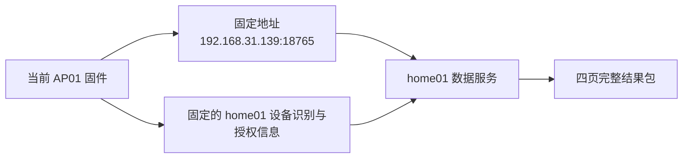

# home01-MacBookAir 与 home02-macmini 的 AGENTS 看板切换

记录日期：2026-07-29

用途：开发设备切回 home01-MacBookAir 时，恢复与当前已刷 AP01 固件匹配的数据源和服务端。

技术定义只见
[`AP01 优化固件 DESIGN`](../reference/DESIGN/AP01-1.0.2_0031-opt.bin.md) 第 7 至 9 节；
本文只记录两台设备的运行位置和切换步骤。

## 1. 最重要的限制

当前 AP01 中的观察成品同时固定了两项内容：

1. 服务地址 `192.168.31.139:18765`；
2. home01 原设备专属配置派生出的设备识别和取包授权信息。

因此，**只有同时恢复原地址和原配置，home01 才能直接接回当前固件**。home02 新建的
`env/agents-dashboard-device-home02-pending.json` 不匹配当前固件，不能替代、覆盖或改名
冒充原配置。



任何一条不匹配，设备到服务端的取数链路都不成立。

## 2. 已记录位置

| 项目 | home01-MacBookAir | home02-macmini |
| --- | --- | --- |
| 主机局域网地址 | `192.168.31.139` | `192.168.31.174` |
| 服务端口 | `18765` | `18765` |
| AP01 地址 | 安装记录为 `192.168.31.231` | 2026-07-29 实测仍为 `192.168.31.231` |
| 项目目录 | 历史记录使用 `/Users/mac/Desktop/cuktech-ap01-firmware-tools`，切回后必须实机确认 | `/Users/mac/Desktop/cuktech-ap01-firmware-tools` |
| Codex 数据根目录 | 历史默认 `/Users/mac/.codex`，切回后必须确认 | `/Users/mac/.codex`，已实测 |
| 设备专属配置 | 历史默认位置为 `env/agents-dashboard-device.json`；原文件尚未迁回 home02 | `env/agents-dashboard-device-home02-pending.json`，只供下一版候选固件 |
| 聚合缓存 | 历史默认 `env/agents-dashboard-cache/` | `env/agents-dashboard-cache/` |
| 四页结果 | 历史默认 `artifacts/agents-dashboard/` | `artifacts/agents-dashboard/`，可重新生成 |
| 字体目录 | 历史默认 `env/fonts/` | `env/fonts/`，已恢复且被版本控制忽略 |
| 常驻任务 | 历史状态未知 | `/Users/mac/Library/LaunchAgents/com.cuktech.ap01.agents-dashboard.home02.plist` |

采集器在两台电脑上都只读取当前用户自己的以下位置，换机时通过运行参数指定数据根目录，
不把登录文件或会话正文复制进项目：

| 数据 | 记录位置 |
| --- | --- |
| 当前登录文件 | `/Users/mac/.codex/auth.json` |
| 活动会话 | `/Users/mac/.codex/sessions/` |
| 已归档会话 | `/Users/mac/.codex/archived_sessions/` |
| 安全聚合缓存 | 项目下 `env/agents-dashboard-cache/` |

当前已刷固件：

| 项目 | 冻结记录 |
| --- | --- |
| 文件名 | `ap01-1.0.2_0031-agents-stock-local-branches-observation.bin` |
| 文件大小 | 6,804,520 字节 |
| SHA-256（用于确认文件完全相同的长指纹） | `1958bf4796635684c5e1b004472665daf11404faab2f204184169b7138c4dc48` |
| MD5（另一种历史文件指纹） | `a6935dac9d0d8fcc2dd320a0e5391636` |
| 对应实现提交 | `0453a0d6d04455011cd684eb2bb542f140d63f8c` |
| 安装记录提交 | `d40ee75b6a27e2ccd70665870bae9d72f3b5748d` |
| 安装记录 | [`2026-07-29-AGENTS原厂局部分支观察成品首次安装.md`](../knowledge/AP01-官方固件分析/cases/2026-07-29-AGENTS原厂局部分支观察成品首次安装.md) |

home02 候选配置的 SHA-256 为
`ac73272c8b79cece18ea8159f62d6704a9e026a695ef3dd6734c18e31a3c5e67`，权限为 `600`。
该指纹只用于识别 home02 候选配置，不能据此重建其内容，也不能与 home01 原配置混用。

## 3. 切回前要从 home01 保留的材料

### 3.1 必须原样保留

- `env/agents-dashboard-device.json`；
- 当前已刷成品及其构建清单；
- `artifacts/firmware/opt-setting.bin` 及其构建清单；
- `/Users/mac/Desktop/cuktech-ap01-firmware-artifacts/original/ap01-1.0.2_0031.bin`；
- home01 实际使用的常驻任务文件；
- 能说明当时服务启动参数、监听地址和错误的日志。

其中设备专属配置不得提交到版本库、不得打印内容、不得经聊天传输。迁移后文件权限应为
`600`，即只有当前用户可读写。

### 3.2 可以重建，不作为身份备份

- `artifacts/agents-dashboard/` 四页结果包；
- `env/agents-dashboard-cache/` 安全聚合缓存；
- 普通运行日志；
- 来自用户自有字体库或官方来源的字体文件。

这些文件能缩短首次启动时间，但不能代替第 3.1 节的设备专属配置和固件材料。

## 4. 切回 home01 的执行顺序

### 4.1 先让两台服务端只保留一个

若 home02 仍在线，先在 home02 停止常驻任务：

```shell
launchctl bootout \
  "gui/$(id -u)" \
  /Users/mac/Library/LaunchAgents/com.cuktech.ap01.agents-dashboard.home02.plist
```

`launchctl（管理 macOS 登录后常驻任务的系统命令）` 只停止该任务，不删除配置或结果文件。
不要让 home01 和 home02 同时占用 `192.168.31.139:18765`。

### 4.2 恢复 home01 的固定地址

1. 把 home01 接入 AP01 当前所在的同一局域网；
2. 在路由器中把 home01 固定为 `192.168.31.139`；
3. 确认该地址未被其他设备占用；
4. 若 home01 无法取得 `.139`，立即停止。当前固件不能仅靠改服务参数转向其他地址。

### 4.3 恢复项目和专属材料

1. 将项目更新到远端 `opt-bin` 分支最新提交；
2. 将第 3.1 节材料放回其记录位置；
3. 确认原设备专属配置的文件指纹与 home01 备份一致；
4. 执行：

```shell
chmod 600 \
  /Users/mac/Desktop/cuktech-ap01-firmware-tools/env/agents-dashboard-device.json
```

不要运行 `--initialize-config`。该参数会在目标文件不存在时生成另一套身份，只用于后续新固件。

### 4.4 先以前台方式启动

```shell
cd /Users/mac/Desktop/cuktech-ap01-firmware-tools

python3 -m features.agents_dashboard.bridge \
  --bind 0.0.0.0 \
  --port 18765 \
  --interval 300 \
  --config env/agents-dashboard-device.json \
  --codex-home /Users/mac/.codex \
  --cache-directory env/agents-dashboard-cache \
  --output artifacts/agents-dashboard \
  --font-directory env/fonts
```

前台启动必须成功生成或验证四页完整结果包。若数据刷新失败，只有已有旧结果能用原配置完整
验证时才允许服务继续运行。

### 4.5 检查本机和局域网

`curl（从命令行读取指定网络地址的小工具）` 可读取不含专属配置的健康结果：

```shell
curl --fail --silent --show-error \
  http://127.0.0.1:18765/health

curl --fail --silent --show-error \
  http://192.168.31.139:18765/health
```

只有同时满足以下条件才继续：

- `ok` 为 `true`；
- `degraded` 为 `false`；
- `error` 为 `null`；
- `quota`、`reset_cards`、`profile`、`local_sessions` 均为 `true`。

健康结果只证明服务端本身可用。等待 AP01 的正常后台刷新后，只有 `requests` 增加且
`last_request` 更新，才证明当前 AP01 已重新接入。不要为了触发请求而旋转或按压当前设备。

### 4.6 再恢复常驻任务

前台验证通过后，才根据 home01 的实际 Python 路径、项目路径和日志路径恢复其常驻任务。
可参考 home02 的文件结构，但必须把任务名称改为
`com.cuktech.ap01.agents-dashboard.home01`，配置路径必须仍指向
`env/agents-dashboard-device.json`。不要直接复制带有 home02 路径或候选配置的文件。

恢复后重新读取 `/health`，并确认常驻任务重启一次后仍能提供有效旧包或生成新包。

## 5. 再切回 home02

1. 停止 home01 常驻任务；
2. 恢复 home02 的固定地址和候选服务；
3. 执行：

```shell
launchctl bootstrap \
  "gui/$(id -u)" \
  /Users/mac/Library/LaunchAgents/com.cuktech.ap01.agents-dashboard.home02.plist
```

4. 检查 `http://127.0.0.1:18765/health` 和
   `http://192.168.31.174:18765/health`；
5. 在固件仍固定 `.139` 且仍使用 home01 原配置期间，不宣称 AP01 已接入 home02。

若将来要让当前 AP01 长期使用 home02，必须在 DESIGN 中先确定并冻结“迁回原配置与原地址”
或“制作匹配 home02 新配置和新地址的新固件”其中一条路径，再按固件制作规范执行。
