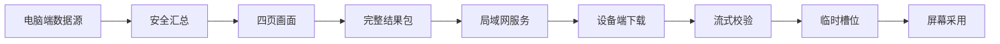

# AGENTS 看板的数据生成与拉取

## 1. 本文管什么

本文说明一类“电脑生成数据，设备定时拉取并显示”的看板系统应怎样设计。这里的 AGENTS 看板是一个具体例子：电脑端把当前用户可公开给设备看的汇总数据画成四页图片，再封装成一个设备可校验的结果包；设备端只下载这个结果包，校验通过后再替换屏幕上的四页画面。

本文重点是技术原理。具体地址配置格式只见 [`技术实现第 9.3 节`](../reference/DESIGN/ap01-1.0.2_0031-opt.bin技术实现/ap01-1.0.2_0031-opt.bin技术实现.md#93-地址配置与两种固件)，结果包字段只见 [`技术实现第 8.3 节`](../reference/DESIGN/ap01-1.0.2_0031-opt.bin技术实现/ap01-1.0.2_0031-opt.bin技术实现.md#83-结果包头)，设备端取包细节只见 [`技术实现第 9.4 节`](../reference/DESIGN/ap01-1.0.2_0031-opt.bin技术实现/ap01-1.0.2_0031-opt.bin技术实现.md#94-设备端如何跨服务端取数据)。

## 2. 整体模型



这个模型有三个核心原则：

- 服务端只发布设备需要看的结果，不发布会话正文、提示词、登录凭据或本机私有路径。
- 设备端只采用完整且通过校验的一整包数据，不采用半包，也不合并多台电脑的数据。
- 生成、发布、下载、校验、采用是五件事。前一步成功不能证明后一步成功。

## 3. 服务端如何生成数据

服务端运行在用户自己的电脑上。它每一轮先读取当前电脑的数据源，得到一次快照；随后用同一份快照生成四页画面；最后把四页画面合成一个结果包，并通过局域网提供下载。

本项目当前有四类数据源，给 AI（会按要求写代码和回答问题的程序）执行时按下表判断“这项数据到底从哪里来”：

| 数据名称 | 获取方法 |
| --- | --- |
| 当前账号额度 | 工具：Python（运行本项目脚本的程序）。命令：`.venv/bin/python -m features.agents_dashboard.generate_actual --output artifacts/agents-dashboard/local-check`，或启动服务时用 `.venv/bin/python -m features.agents_dashboard.bridge --bind 0.0.0.0 --port 18765 --interval 300 --codex-home ~/.codex`。模块：`features/agents_dashboard/collector.py` 里的 `collect_snapshot` 调用 `fetch_quota`。来源：读取本机 Codex（本机的编程助手应用）登录状态后访问官方额度接口。用途：周剩余额度、下次重置时间。失败时：对应字段显示“无法获取”。 |
| 重置卡 | 工具：Python。命令：同上，入口仍是 `features.agents_dashboard.generate_actual` 或 `features.agents_dashboard.bridge`。模块：`features/agents_dashboard/collector.py` 里的 `collect_snapshot` 调用 `fetch_reset_cards`。来源：读取本机 Codex 登录状态后访问官方重置卡接口。用途：可用重置卡数量、到期时间。失败时：对应字段显示“无法获取”。 |
| 个人统计 | 工具：Python。命令：同上。模块：`features/agents_dashboard/collector.py` 里的 `collect_snapshot` 调用 `fetch_profile`。来源：读取本机 Codex 登录状态后访问官方个人统计接口。用途：近 30 天用量、活动统计、常用插件。失败时：对应字段显示“无法获取”。 |
| 本地会话记录 | 工具：Python。命令：同上。模块：`features/agents_dashboard/collector.py` 里的 `collect_snapshot` 调用 `scan_today_sessions`。来源：扫描本机 Codex 会话记录中的计数事件。用途：今日输入、输出、缓存、请求数和费用估算。失败时：对应字段显示“无法获取”。 |

这里读取的是 Codex 保存在用户电脑上的登录状态和会话计数。服务端只取计数字段、模型名、时间和已有费用字段，不读取也不发布用户与 AI 的正文。

## 4. 本项目可直接执行的工具和命令

本节给其他用户和 AI 直接照做。前文是原理；本节是本仓库当前能调用的入口。

### 4.1 先确认运行环境

当前正式支持的系统只见 [`requirements.md`](../reference/requirements.md)：macOS（苹果电脑系统）已经整理；Windows（微软电脑系统）和 Linux（另一类电脑系统）尚未整理和验证。Windows 上即使临时补齐依赖后跑通，也只能写“实验成功”，不能写“项目已支持 Windows”。

在仓库根目录执行：

```bash
pwd
git status --short --branch
test -d .venv || python3 -m venv .venv
.venv/bin/python -m pip install 'Pillow==12.2.0'
.venv/bin/python - <<'PY'
from pathlib import Path
from zoneinfo import ZoneInfo
from PIL import Image

required = [
    "fonts/MiSans-Regular.ttf",
    "fonts/MiSans-Medium.ttf",
    "fonts/MiSans-Semibold.ttf",
    "fonts/MiSans-Bold.ttf",
]
missing = [item for item in required if not Path(item).is_file()]
if missing:
    raise SystemExit("缺少字体：" + ", ".join(missing))
print("时区：", ZoneInfo("Asia/Shanghai"))
print("Pillow：", Image.__version__)
PY
```

Python 是运行本项目脚本的程序；`.venv` 是放在项目里的独立 Python 运行环境；Pillow 是处理图片的程序库。时区检查必须通过，因为今日消耗和重置时间都依赖 `Asia/Shanghai`。

如果是在 Windows 上临时复测，且出现找不到 `Asia/Shanghai` 的错误，只能作为未正式支持平台的临时处理：

```powershell
.venv\Scripts\python.exe -m pip install tzdata
```

tzdata 是给 Python 提供各地时区规则的数据包。补装后跑通，不改变“Windows 当前不支持”的项目状态。

### 4.2 获取服务电脑地址

`AP01_AGENTS_HOSTS` 要填写的是服务电脑的局域网 IPv4（局域网里常见的四段数字地址）地址，不是 MAC（网卡的硬件编号）地址，也不是 IPv6（更长、带冒号的网络地址）地址。AP01 只能按这个 IPv4 地址访问电脑上的 `/a` 接口。

AI 优先用本项目模块自动判断：

```bash
.venv/bin/python - <<'PY'
from features.agents_dashboard.bridge import lan_ip

print(lan_ip())
PY
```

这个命令调用 `features/agents_dashboard/bridge.py` 里的 `lan_ip`。它会优先使用 `AP01_LAN_IP`，没有填写时尝试读取 macOS 的 `en0`、`en1` 网卡地址，最后再用系统路由推断。

macOS 兜底命令：

```bash
interface="$(route -n get default | awk '/interface:/{print $2}')"
ipconfig getifaddr "$interface"
```

如果上面没有结果，再试：

```bash
ipconfig getifaddr en0 || ipconfig getifaddr en1
```

结果应类似 `10.0.0.12` 或 `172.16.0.8`。不要填写 `127.0.0.1`，因为它只表示 “本机自己”，AP01 不能用它访问电脑。也不要填写公网地址、手机热点外网地址、Tailscale（虚拟组网工具）地址或代理地址，除非已经单独验证 AP01 能访问。

写入配置：

```bash
cp -n env/agents-dashboard.env.example env/agents-dashboard.env
chmod 600 env/agents-dashboard.env
```

编辑 `env/agents-dashboard.env`：

```text
AP01_AGENTS_HOSTS="10.0.0.12"
AP01_AGENTS_PORT=18765
```

快速校验配置能被个人固件构建程序接受：

```bash
.venv/bin/python - <<'PY'
from pathlib import Path
from features.agents_dashboard_firmware.endpoint_config import load_endpoint_config

config = load_endpoint_config(Path("env/agents-dashboard.env"))
print(config.endpoints)
PY
```

### 4.3 只生成本机真实数据和预览图

只想确认“服务端能采集和画图”，运行：

```bash
.venv/bin/python -m features.agents_dashboard.generate_actual \
  --output artifacts/agents-dashboard/local-check
```

Windows 临时复测命令为：

```powershell
.venv\Scripts\python.exe -m features.agents_dashboard.generate_actual `
  --output artifacts\agents-dashboard\local-check
```

这个入口会调用：

```text
features.agents_dashboard.generate_actual
  -> collect_snapshot
  -> render_all
```

具体生成关系如下：

| 数据名称 | 获取方法 |
| --- | --- |
| 本机结构化快照 | 工具：Python。命令：`.venv/bin/python -m features.agents_dashboard.generate_actual --output artifacts/agents-dashboard/local-check`。模块：`features/agents_dashboard/generate_actual.py` 里的 `generate` 调用 `collect_snapshot`。输出：`snapshot.json`。 |
| 概览页预览图 | 工具：Python 和 Pillow。命令：同上。模块：`features/agents_dashboard/generate_actual.py` 调用 `features/agents_dashboard/renderer.py` 里的 `render_all`。输入：同一次 `snapshot.json` 对应的快照。输出：`01-概览-真实数据.png`。 |
| 周剩余额度页预览图 | 工具：Python 和 Pillow。命令：同上。模块：`render_all`。输入：同一次快照。输出：`02-周剩余额度-真实数据.png`。 |
| 今日消耗页预览图 | 工具：Python 和 Pillow。命令：同上。模块：`render_all`。输入：同一次快照。输出：`03-今日消耗-真实数据.png`。 |
| 近 30 天消耗页预览图 | 工具：Python 和 Pillow。命令：同上。模块：`render_all`。输入：同一次快照。输出：`04-近30天消耗-真实数据.png`。 |
| 四页对照图 | 工具：Python 和 Pillow。命令：同上。模块：`features/agents_dashboard/generate_actual.py` 里的 `_render_comparison`。输入：视觉参考图和本机真实数据图。输出：`效果图-真实图-四页对照.png`。 |

它会生成：

| 文件 | 含义 |
| --- | --- |
| `snapshot.json` | 本机采集到的结构化快照 |
| `01-概览-真实数据.png` | 概览页预览图 |
| `02-周剩余额度-真实数据.png` | 周剩余额度页预览图 |
| `03-今日消耗-真实数据.png` | 今日消耗页预览图 |
| `04-近30天消耗-真实数据.png` | 近 30 天消耗页预览图 |
| `效果图-真实图-四页对照.png` | 视觉参考和本机真实图对照 |

读取关键结果：

```bash
.venv/bin/python - <<'PY'
import json
from pathlib import Path

snapshot = json.loads(
    Path("artifacts/agents-dashboard/local-check/snapshot.json").read_text(
        encoding="utf-8"
    )
)
today = snapshot["today"]
print("生成时间：", snapshot["generated_at"])
print("本周剩余额度：", snapshot["weekly_remaining_percent"])
print("下次重置：", snapshot["weekly_reset_at"])
print("可用重置卡：", snapshot["reset_cards_available"])
print("今日总消耗：", today["total_tokens"])
print("今日请求数：", today["request_count"])
print("缓存命中率：", today["cache_hit_percent"])
print("今日估算费用：", today["api_cost_usd"])
print("近 30 天累计消耗：", snapshot["last_30d_tokens"])
print("数据源：", {
    "quota": snapshot["quota_available"],
    "reset_cards": snapshot["reset_cards_source_available"],
    "profile": snapshot["profile_available"],
    "local_sessions": snapshot["local_sessions_available"],
})
PY
```

JSON 是一种给程序交换结构化数据的文本格式。以上命令只证明本机采集和预览图生成成功，不证明服务已经发布，也不证明设备已经拉取。

### 4.4 启动服务端并生成设备结果包

要让设备或另一台电脑通过局域网读取结果包，运行服务端：

```bash
.venv/bin/python -m features.agents_dashboard.bridge \
  --bind 0.0.0.0 \
  --port 18765 \
  --interval 300 \
  --codex-home ~/.codex
```

`features.agents_dashboard.bridge` 是本项目的看板服务入口；它启动时会先刷新一次，之后每 300 秒刷新一次。服务启动后，在另一个终端检查：

```bash
curl --fail --silent --show-error http://127.0.0.1:18765/health
curl --fail --silent --show-error \
  --output /tmp/ap01-agents.apag \
  http://127.0.0.1:18765/a
.venv/bin/python - <<'PY'
from pathlib import Path
from features.agents_dashboard.result_package import decode_package

package = Path("/tmp/ap01-agents.apag").read_bytes()
decoded = decode_package(package)
print("生成代号：", decoded.generation)
print("页面数量：", len(decoded.pages))
print("页面字节：", [len(page) for page in decoded.pages])
PY
```

curl 是命令行里访问网页地址的工具。`/health` 证明服务状态，`/a` 取得设备要下载的完整结果包。 `decode_package` 是本项目解码并检查结果包的函数。以上命令通过，只证明服务端发布了可解码结果包；仍不证明 AP01 已经请求或显示。

## 5. 看板数据有哪些

一次快照包含以下可显示数据。给 AI 复现时，不要让它自己猜字段来源，按下表执行：

| 数据名称 | 获取方法 |
| --- | --- |
| 生成时间、各数据源是否可用、价格表核对日期 | 工具：Python。命令：`.venv/bin/python -m features.agents_dashboard.generate_actual --output artifacts/agents-dashboard/local-check`。模块：`features/agents_dashboard/collector.py` 的 `collect_snapshot` 汇总，输出到 `snapshot.json`。 |
| 周剩余额度、额度重置时间 | 工具：Python。命令：同上，或服务端命令 `.venv/bin/python -m features.agents_dashboard.bridge --bind 0.0.0.0 --port 18765 --interval 300 --codex-home ~/.codex`。模块：`collect_snapshot -> fetch_quota`。输出字段：`weekly_remaining_percent`、`weekly_reset_at`。 |
| 重置卡数量、每张卡状态、发放时间、到期时间、使用时间 | 工具：Python。命令：同上。模块：`collect_snapshot -> fetch_reset_cards`。输出字段：`reset_cards_available`、`reset_cards`。 |
| 今日总量、原始输入、新输入、输出、缓存读取、缓存写入、推理输出、请求数、缓存命中率、费用 | 工具：Python。命令：同上。模块：`collect_snapshot -> scan_today_sessions`，费用由 `features/agents_dashboard/pricing.py` 计算。输出字段：`today`。 |
| 模型名、各类计数、请求数、长上下文请求数、费用 | 工具：Python。命令：同上。模块：`scan_today_sessions` 按模型汇总，费用仍由 `features/agents_dashboard/pricing.py` 计算。输出字段：`today.model_usage`。 |
| 近 30 天每日用量、30 天总量 | 工具：Python。命令：同上。模块：`collect_snapshot -> fetch_profile` 后由 `_daily_window` 整理最近 30 天。输出字段：`daily_30d`、`last_30d_tokens`。 |
| 快速模式占比、最常用推理强度、已探索技能数、技能使用次数、任务数、最长任务时长 | 工具：Python。命令：同上。模块：`collect_snapshot -> fetch_profile -> _parse_profile_response`。输出字段：`activity`。 |
| 常用插件名称和使用次数 | 工具：Python。命令：同上。模块：`fetch_profile -> _parse_profile_response` 从个人统计中筛选插件调用。输出字段：`common_plugins`。 |

这些字段先进入结构化快照，再交给画面渲染程序。渲染程序负责排版、单位、缺失值展示和字号控制；采集程序不直接决定画面坐标。

## 6. 服务端如何发布给设备

服务端每轮发布遵循“先生成临时结果，再一次性替换正式结果”的思路：

| 数据名称 | 获取方法 |
| --- | --- |
| 当前快照 | 工具：Python。命令：`.venv/bin/python -m features.agents_dashboard.bridge --bind 0.0.0.0 --port 18765 --interval 300 --codex-home ~/.codex`。模块：`features/agents_dashboard/bridge.py` 的 `BridgeState.refresh` 调用 `features/agents_dashboard/result_package.py` 的 `publish_current_result`，再调用 `collect_snapshot`。 |
| 四页 PNG（常见图片文件格式）预览图 | 工具：Python 和 Pillow。命令：同上。模块：`publish_current_result -> render_all`。输出：临时目录中的四页 PNG。 |
| 四页设备动图 | 工具：Python 和 Pillow。命令：同上。模块：`publish_current_result -> png_to_device_gif`，周剩余额度页使用 `weekly_to_device_gif`。输出：`01-overview.gif`、`02-weekly.gif`、`03-today.gif`、`04-last-30-days.gif`。 |
| 完整结果包 | 工具：Python。命令：同上。模块：`publish_current_result -> encode_package`。输出：`agents-dashboard.apag`。 |
| 结果包回读检查 | 工具：Python。命令：同上自动执行；人工检查命令见第 4.4 节。模块：`publish_current_result -> decode_package`。作用：确认包头、长度、页数、页面格式和校验值都正确。 |
| 清单文件 | 工具：Python。命令：同上。模块：`publish_current_result`。输出：`manifest.json`，记录生成代号、结果包大小、结果包 SHA-256（文件内容指纹）、四页大小和四页指纹。 |
| 局域网下载入口 | 工具：Python 内置 HTTP（让电脑提供网页访问的规则）服务。命令：同上。模块：`features/agents_dashboard/bridge.py`。接口：`/a` 返回完整结果包，`/health` 返回服务状态。 |

服务端只把最后的正式结果包暴露给设备。任一步失败时，旧的已验证结果包继续保留。

本项目服务端提供两个路径：

| 路径 | 返回内容 | 用途 |
| --- | --- | --- |
| `/a` | 完整结果包 | 设备端下载 |
| `/health` | 服务状态、请求计数、刷新状态、四类数据源状态 | 人或自动检查程序判断服务是否可用 |

每次响应都带明确长度，并禁止缓存，避免设备拿到过期包。

## 7. 结果包为什么要这样设计

设备端内存和文件系统能力有限，不能依赖一次性把所有数据读进内存后再判断。因此结果包必须让设备可以边下载边校验。

结果包采用固定顺序：概览、周剩余额度、今日消耗、近 30 天消耗。包头记录包版本、生成代号、总长度、四页长度和四页校验值。设备先读包头，再按包头声明的长度逐页接收。这样可以做到：

- 下载刚开始就能拒绝版本、页数或总长度错误的包；
- 单页结束时立刻检查动图格式、帧数和校验值；
- 四页都成功后再发布给显示端；
- 任意一步失败都能丢弃本轮临时文件，不影响正在显示的旧画面。

## 8. 设备端如何拉取数据

设备端不主动理解服务端的数据来源，也不解析额度、费用或插件字段。它只关心一件事：能否取得一份完整且有效的四页结果包。

设备端取数按下表实现：

| 数据名称 | 获取方法 |
| --- | --- |
| 服务地址表 | 工具：个人固件制作程序。命令模板：`.venv/bin/python app/ap01_firmware.py agents-personalized-build --input <设置菜单固件> --env-file env/agents-dashboard.env --output <个人固件输出路径> --manifest <构建记录路径> --build-dir <构建临时目录>`。地址配置规则只见[技术实现第 9.3 节](../reference/DESIGN/ap01-1.0.2_0031-opt.bin技术实现/ap01-1.0.2_0031-opt.bin技术实现.md#93-地址配置与两种固件)。模块：`app/ap01_firmware.py` 调用 `features/agents_dashboard_firmware/endpoint_config.py` 读取配置，再调用 `features/agents_dashboard_firmware/sync_build.py` 把地址写入设备端程序。设备端模块：`features/agents_dashboard_firmware/result_loader.c` 的 `endpoint_at` 按序号读取固件内地址。这个命令只证明个人固件写入了地址，不证明设备已经请求 `/a`。 |
| 一轮取包触发 | 工具：设备固件里的原厂网络执行入口。命令：设备运行时自动触发，电脑上没有手工命令可以直接代替它。模块：`features/agents_dashboard_firmware/result_loader.c` 的 `ap01_agents_webclient_wrapper` 包装原厂网络执行上下文。周期设计：每 300 秒一轮。 |
| `/a` 完整结果包 | 工具：设备固件里的原厂网络函数。命令：设备运行时由 `ap01_agents_download_package` 自动把请求地址改为地址表中的 `http://<地址>:<端口>/a`。模块：`result_loader.c` 的 `ap01_agents_download_package` 按地址顺序请求，`ap01_agents_sink` 接收数据。 |
| 包头、页面长度和页面校验值 | 工具：设备端 C（常用来写底层程序的语言）程序。命令：设备下载时自动执行。模块：`result_loader.c` 的 `ap01_agents_sink`、`validate_package_header`、`finish_current_page`。作用：边下载边校验，不把整包一次性放进内存。 |
| 四页临时动图 | 工具：设备文件系统。命令：设备下载时自动写入 `/tmp/.ap01a00.gif` 到 `/tmp/.ap01a23.gif` 中的一个槽位。模块：`result_loader.c` 的 `page_path`、`open_current_page`、`consume_body`。 |
| 已发布记录 | 工具：设备文件系统。命令：设备端确认四页都有效后自动写入 `/tmp/.ap01a.meta`。模块：`result_loader.c` 的 `write_record`。作用：告诉显示端哪一组槽位是最新完整结果。 |
| 已采用记录 | 工具：设备文件系统。命令：显示端成功切换动图后自动写入 `/tmp/.ap01a.ack`。模块：`result_loader.c` 的 `ap01_agents_apply_current` 调用 `write_record`。作用：避免重复设置已经显示的同一组结果。 |
| 屏幕当前页画面 | 工具：原厂动图对象。命令：设备界面定时器自动触发。模块：`result_loader.c` 的 `ap01_agents_ui_timer_wrapper` 调用 `ap01_agents_apply_current`，再调用原厂动图设置函数。 |

这样做的好处是设备逻辑简单：多台电脑互为备选服务端，但设备始终只采用本轮第一个成功结果，不做跨电脑拼接，也不需要判断用户在哪个地点。

## 9. 设备端怎样保证失败不破坏当前画面

设备端使用三个临时槽位保存页面文件。每个槽位都有四页动图。设备还维护两份小记录：

| 记录 | 含义 |
| --- | --- |
| 已发布记录 | 最近一次下载并校验通过的槽位和生成代号 |
| 已采用记录 | 显示端已经切到屏幕上的槽位和生成代号 |

下载新包时，设备优先选择既不是已发布槽位、也不是已采用槽位的空闲槽位。接收过程中逐字节检查包头、页面长度、动图结构、帧数和校验值。只有四页全部通过，并且网络返回成功，才写入已发布记录。

显示端不直接读取正在下载的槽位。它在界面定时器里读取已发布记录；如果发现新代号，才按当前看板页号把对应页面设置到原厂动图对象上。设置成功后写入已采用记录。设置失败时恢复原厂萌宠，不写入已采用记录。

这等于把“下载完成”和“屏幕采用”分开：下载成功只说明文件可用，屏幕采用成功才说明用户可能看到了新画面。

## 10. 原厂网络入口的复用方法

在已有设备固件里改造网络功能时，优先复用原厂已经稳定工作的网络执行函数，而不是另写一套网络栈。本项目的设备端做法是包装原厂网络执行上下文：

- 保存原来的地址、超时、接收函数、接收参数、响应状态和网络工作状态；
- 把地址临时改成看板服务 `/a`；
- 把接收函数临时改成看板结果包校验函数；
- 调用原厂网络执行函数；
- 无论成功失败，都恢复原来的上下文字段。

如果同一个入口还负责原厂天气等功能，看板请求不能破坏原厂请求的返回值和响应状态。看板成功或失败只能影响看板画面，不能伪装成原厂天气成功，也不能让原厂天气逻辑误判。

## 11. 最小验收方法

实现这一类系统时，建议把验收分成四层，不要互相替代：

| 层级 | 要证明什么 | 常见检查 |
| --- | --- | --- |
| 服务端生成 | 电脑能采集、绘制、封包并保留旧包 | 运行刷新、解码结果包、检查 `/health` |
| 服务端发布 | 局域网内能拿到完整结果包 | 从另一台机器请求 `/a` 并解码 |
| 设备端拉取 | 设备确实访问了 `/a` 并通过校验 | 看服务端请求计数、日志、设备临时文件或诊断画面 |
| 屏幕采用 | 用户在设备屏幕上看到新画面且交互正常 | 真机观察四页切换、返回和相邻页面 |

服务端健康、设备上线、固件安装完成，都不能单独证明设备已经拉取并显示了看板。

## 12. 迁移到其他电脑或其他设备时怎么做

迁移时保留以下技术结构即可：

- 每台服务电脑独立采集本机数据，独立生成完整包；
- 用户地址只写在本机忽略文件或个人固件中，不提交公开仓库；
- 服务端输出固定格式包，而不是让设备理解复杂业务字段；
- 设备端做顺序请求、流式校验、临时槽位、发布记录和采用记录；
- 验收时分开记录服务端生成、网络下载、设备校验、屏幕采用。

只要这些结构不变，数据源可以换成其他应用，页面数量和字段也可以调整；但结果包格式、设备校验规则和发布采用规则必须同时更新，不能只改服务端画面。
