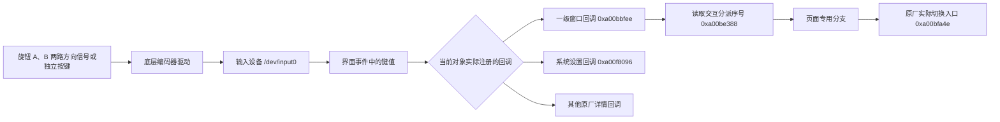

# AP01 原厂各页面物理旋钮交互实现

返回主文档：[`AP01 官方固件分析`](AP01-官方固件分析.md)

## 1. 文档地位与适用范围

本文是官方 `njcuk.enstor.ap01` `1.0.2_0031` 固件中“物理旋钮如何进入界面、由哪个回调
处理、怎样分派到各页面以及怎样切换对象”的唯一技术事实原文。

需求文档只规定用户应看到的交互，DESIGN 只规定如何在本文边界内实现新功能，代码只能实现
已经写入 DESIGN 的方案。其他文档不得重新定义本文的键值方向、页面序号、回调、状态字段或
原厂调用入口，只能引用本文。

本文结论分为三类：

| 标记 | 含义 |
| --- | --- |
| 已确认 | 能从当前已校验固件的注册点、调用关系或字节位置直接复查 |
| 真机已确认 | 已有对应案例记录，且物理设备表现与静态调用关系一致 |
| 未确认 | 当前证据不足，不能作为代码依据 |

运行地址等于文件偏移加 `0x9ffff000`。这个换算、本文地址和本文结论只适用于
`1.0.2_0031`。官方版本、文件长度或完整文件指纹任一变化时，本文全部地址与复用结论立即
失效，必须从新固件重新分析。

## 2. 从物理动作到页面行为的完整链路

### 2.1 物理输入层

固件中的 `Encoder CW`、`Encoder CCW`、`Encoder button pressed` 和
`Encoder button released` 证明硬件由两路旋转信号和一路独立按键信号组成。界面统一能
取得数值 `19`、`20`、`10` 三类键值。

底层方向处理在运行地址 `0xa0107e14` 读取当前步进方向；在 `0xa0107e20` 检测到同一格内
方向变化时提前结束当前格。固件还分别保留顺时针、逆时针方向变化和无效相位的日志分支。
因此，物理方向必须沿当前回调的原始分支和原始方向参数判断，不能只凭数值常量推断。

旋钮事件还参与原厂屏幕保护、熄屏和唤醒计时。新事件入口必须先保留原厂唤醒路径，不能让
熄屏状态下的第一格操作直接进入自定义页面切换。

### 2.2 键值只在所属回调内有意义

已定位的两个原厂回调对数值 `19`、`20` 的分支命名并不相同：

| 实际注册对象 | 实际回调 | 当前静态证据中的分支 |
| --- | --- | --- |
| 一级窗口容器 | `0xa00bbfee` | 已定位局部分支中，`19` 进入左键树，`20` 进入右键树，`10` 进入确认树 |
| 系统设置页 | `0xa00f8096` | 回调直接把 `19` 作为右旋、`20` 作为左旋 |

这意味着 `19=某一物理方向`、`20=另一物理方向` 不能成为整个固件共用的全局合同。实现时
必须先从当前对象的事件注册位置确定实际回调，再沿该回调自己的比较、分支和传参确认方向。
不得让一级窗口、系统设置、详情页或新增功能共用一套未经逐回调证明的左右常量。

## 3. 一级窗口的对象、注册与状态

显示初始化入口为 `0xa00b2420`。它在 `0xa00b248a` 创建一级窗口容器，随后建立九个直接
子对象：

| 原厂交互分派序号 | 页面或内部对象 | 创建调用位置 | 旋钮处理归属 |
| ---: | --- | --- | --- |
| 0 | 功率 | `0xa00b2602` | 一级窗口回调 |
| 1 | C1 条件页 | `0xa00b2652` | 一级窗口回调 |
| 2 | C2 条件页 | `0xa00b268c` | 一级窗口回调 |
| 3 | 时间 | `0xa00b2696` | 一级窗口回调及原厂详情分支 |
| 4 | 日期 | `0xa00b26b4` | 一级窗口回调及原厂详情分支 |
| 5 | 天气 | `0xa00b26d4` | 一级窗口回调及原厂详情分支 |
| 6 | 设置 | `0xa00b26f4` | 一级窗口回调进入，设置页自己的回调继续处理 |
| 7 | 萌宠 | `0xa00b2714` | 一级窗口回调 |
| 8 | 米家详情或原厂内部详情状态 | `0xa00b2734` | 一级窗口回调中的原厂内部详情分支 |

序号 `1`、`2` 通过共同入口 `0xa00f315a` 创建，分别传入端口标识 `1`、`2`。序号 `8`
还被原厂内部详情交互使用，不能作为新增一级页面身份。

显示初始化在 `0xa00b2838` 至 `0xa00b2846` 把 `0xa00bbfee` 注册到一级窗口容器，事件
筛选值为 `17`。因此一级旋钮交互的审计入口必须是这处实际注册点，不能用固件中形状相似的
通用窗口事件 `0xa00b08fc` 代替。

一级窗口实际使用以下三项状态入口：

| 作用 | 原厂入口 | 直接行为 |
| --- | --- | --- |
| 读取当前交互分派序号 | `0xa00be388` | 读取容器偏移 `52` |
| 按序号取得当前对象 | `0xa00be3ca` | 调用 `0xa00c5d84` |
| 切换对象 | `0xa00bfa4e` | 目标写入偏移 `52`，原序号写入偏移 `56`，再移动对象 |

固件中的 `0xa00b0290`、`0xa00b0570`、`0xa00b05ba`、`0xa00b06f4` 属于另一组窗口状态
入口，读写偏移 `56`、`60`。当前没有证据证明两组入口等价；一级窗口实现不得用这一组相似
入口替换上表三项。

## 4. 一级窗口回调如何处理各页面

`0xa00bbfee` 从事件对象取得一级窗口容器和内部数据，调用 `0xa00bf7ea` 取得键值，并在
左、右、确认三棵分支中反复调用 `0xa00be388` 读取当前交互分派序号。各页面不是各自注册
一套一级旋钮回调，而是由这一个总回调根据当时的分派序号进入不同原厂分支。

左右和确认分支完成页面专用处理后，实际切页都汇合到 `0xa00bc08c` 至 `0xa00bc092`，
调用 `0xa00bfa4e`。原厂左向分支传入切换方式 `2`，右向分支传入切换方式 `1`。自定义代码
需要继续原厂切页时，必须保留原容器、原目标序号和原切换方式。

### 4.1 各页面可确认的旋钮实现

| 页面 | 可确认的原厂实现 | 新功能必须保留的边界 |
| --- | --- | --- |
| 功率，序号 0 | 左右和确认均由一级窗口回调按序号 `0` 进入专用分支；确认路径从 `0xa00bc8c6` 进入 | 不得替换一级总回调；只有第 4.3 节限定的连接与数据有效性局部保护可以先于 `0xa00bc8ca` 执行 |
| C1、C2 条件页，序号 1、2 | 由一级窗口回调按当时分派序号处理；页面是否出现受端口状态控制 | 不得把两个条件页当作普通、永久存在的自定义导航页，不得改写其对象身份 |
| 时间，序号 3 | 由一级窗口回调进入时间分支，详情状态继续使用原厂分派值 | 每次事件都重新读取 `0xa00be388`，不得只凭画面或上一次序号判断当前状态 |
| 日期，序号 4 | 由一级窗口回调进入日期分支，详情进入与返回仍走原厂内部状态 | 不得把原厂详情序号当作新增一级页；返回必须交还原厂 |
| 天气，序号 5 | 由一级窗口回调进入天气分支，详情交互继续使用原厂内部状态 | 不得在读取实际分派序号前抢占左右或确认 |
| 设置，序号 6 | 一级窗口回调负责进入设置；进入后由设置页已注册回调处理列表与详情 | 一级导航和设置列表必须按两套实际回调分别审计，不能共用方向常量 |
| 萌宠，序号 7 | 创建时只注册删除事件回调 `0xa00b75f8`，没有专用旋转或确认回调；旋钮仍由一级窗口回调处理 | 不得虚构萌宠专用旋钮入口；局部扩展必须先验证萌宠对象类型、状态和生命周期 |
| 米家详情或内部详情，序号 8 | 一级窗口回调保留序号 `8` 的原厂分支 | 必须原样交还原厂，不能当作第十个对象或自定义页面身份 |

当前证据只能确认上述分派、入口和保护边界。没有逐分支证明的“端口选择”“日程翻阅”等具体
业务动作属于未确认，不得写入代码依据。

### 4.2 已定位的四个局部分支

以下地址只在对应键值树与分派序号同时成立后可达：

| 组合 | 条件位置 | 原厂目标 | 原厂继续地址 |
| --- | --- | --- | --- |
| 左键树、功率序号 0 | `0xa00bc25c` | `0xa00bc336` | `0xa00bc33a` |
| 左键树、萌宠序号 7 | `0xa00bc2be` | `0xa00bc460` | `0xa00bc464` |
| 右键树、萌宠序号 7 | `0xa00bc5d8` | `0xa00bc712` | `0xa00bc716` |
| 确认键树、萌宠序号 7 | `0xa00bc8fa` | `0xa00bda64` | `0xa00bda68` |

四个目标开头只负责准备后续调用参数。局部扩展没有消费事件时，必须复现被替换的参数准备，
再回到对应原厂继续地址；消费事件时只能进入原厂公共退出地址 `0xa00bc1d2`。不得从局部
扩展重新进入一级总回调。

萌宠右旋继续地址 `0xa00bc716` 不是可以用一次直接切页替代的空壳。它先取得一级容器序号 7
子对象，沿内部指针取得偏移 96 的状态并调用 `0xa007d5b2`，随后继续原厂右旋分支。因此，
自定义逻辑需要从萌宠右侧进入下一原厂页面时，必须恢复原参数并回到 `0xa00bc716`；不得直接
调用 `0xa00bfa4e` 替代这段原厂逻辑。直接证据和首次违反该边界的真机结果只见
[`2026-07-31 FW-AGENTS-007 功率页确认卡住`](cases/2026-07-31-FW-AGENTS-007功率页确认卡住.md)。

### 4.3 基座状态、功率页残留与确认数据生命周期

原厂无条件创建序号 `0` 的功率页对象，但以 `0x62fc4cd8` 的设备端口数决定初始页和导航
资格。触点离线路径累计超过五次失败后才释放 `0x62fcaa00` 指向的功率汇总数据、清零指针并
通知界面；界面离线回调再把设备端口数写为零，并在当前分派序号为 `0` 时复用
`0xa0193862` 离开功率页。因此物理断开后存在功率页短暂残留窗口。

功率确认路径在 `0xa00bc9b0` 读取 `0x62fcaa00`，并在 `0xa00bc9cc` 直接读取该指针，
没有判空。完整地址、调用链和证据边界只见
[`2026-08-01 基座离线功率页残留与确认路径静态定位`](cases/2026-08-01-基座离线功率页残留与确认路径静态定位.md)。

实现功率确认保护时，只允许在原厂已经筛选为“确认键树、功率序号 `0`”的
`0xa00bc8c6` 局部入口检查设备端口数和功率汇总数据指针。两项有效时必须返回
`0xa00bc8ca` 原样继续；任一无效时必须复用原厂离线页面切换入口并从
`0xa00bc1d2` 公共出口结束。不得把该局部保护扩大为一级总回调包装，也不得重写有效状态下的
功率详情实现。

## 5. 系统设置页的独立旋钮实现

设置列表创建入口 `0xa01988d4` 固定创建七个原厂项目。列表事件回调
`0xa00f8096` 从 `0xa00bd8cc` 和 `0xa00bd8d4` 注册，事件筛选值为 `17`。该回调中：

1. 数值 `19` 进入右旋分支，数值 `20` 进入左旋分支；
2. 先遍历页面根对象，寻找对象类型 `26` 的系统设置列表；
3. 从列表数据偏移 `+8` 取得实际列表控件；
4. 从列表对象数据偏移 `+1` 读取当前状态，值 `48..54` 对应项目 `0..6`；
5. 调用 `0xa00f3d5a` 完成相邻项目选中切换；
6. 需要时调用 `0xa00c6dfe` 调整列表位置。

原厂右旋处理 `0→1` 至 `5→6`，到 `6` 停止；原厂左旋处理 `6→5` 至 `1→0`，到 `0`
停止。首尾循环属于优化功能，不是原厂行为。

`0xa00c5fe4` 返回传入对象的直接子对象数。原厂先对页面根对象调用它，是为了找到设置列表，
不是为了取得设置项目数；项目数必须对列表数据偏移 `+8` 指向的实际列表控件重新读取。把
根对象子对象数当成设置项目数，真机已经表现为系统设置一级列表左右无响应。

第八项的局部表、行对象所有权、状态编号、返回行和临时开关页生命周期曾完成专项静态复查，
但第八次循环、开机同迭代双创建和用户进入设置时双创建三种结构均已真机否定。失败与 A 阶段
回退只见
[`FW-PAGE-006-A 进入设置死机`](cases/2026-08-04-FW-PAGE-006-A进入设置死机.md)。后续禁止
调用原厂普通行创建入口扩展设置列表。

原厂返回行使用自己加载的固定“返回”文字指针，共享文字对象入口内部调用当前官方版本的文字
更新入口。直接地址、原字节、调用链和允许的分层复用边界只见
[`原厂返回行标签与文字更新入口静态定位`](cases/2026-08-04-原厂返回行标签与文字更新入口静态定位.md)。
下一实验只能先复用同一个原厂返回行文字对象，不增加列表对象；物理通过前不允许继续包装按下。

## 6. 必须复用的原厂方法

所有涉及物理旋钮的新功能必须按以下顺序实施：

1. 从目标对象的实际事件注册位置开始，确认真正执行的回调和事件筛选值；
2. 在该回调内部确认键值比较、当前状态读取、对象取得、页面专用分支和最终切换入口；
3. DESIGN 先写清要复用的原厂地址、参数、状态字段、失败返回点和禁止改动范围；
4. 只在已经证明的局部分支挂接；未消费事件时恢复原参数并回到原继续地址；
5. 代码完成后反汇编成品，逐项核对注册点、调用目标、方向参数、状态偏移和禁止区；
6. 用物理旋钮逐页验证唤醒、左右、确认、详情进入、详情返回、快速旋转和连续反向；
7. 实测与 DESIGN 不一致时，先在 DESIGN 记录失败方案和下一方案，再改代码。

以下行为一律禁止：

- 用全局 `19/20` 常量代替逐回调方向证明；
- 用形状相似的通用窗口函数替换当前回调直接调用的原厂函数；
- 替换一级窗口总回调，让全部页面事件先经过自定义代码；
- 增删或重排九个一级直接子对象；
- 把交互分派序号 `8` 作为新增一级页面；
- 在未证明容量、所有权和销毁路径时扩展设置列表或页面对象；
- 自定义处理失败后从头重入原厂总回调；
- 只用自动测试宣称物理旋钮已通过。
- 在没有记录基座吸附、供电和实时功率数据状态时，把功率页不可见或功率确认结果归因于固件；

## 7. 对当前优化固件候选的约束

本文建立后，当前完整离线候选必须重新审计以下项目：

1. 一级窗口局部挂接是否只使用 `0xa00be388`、`0xa00be3ca`、`0xa00bfa4e`；
2. 一级窗口与系统设置是否各自保留所属回调的键值方向，是否存在共享全局方向常量；
3. 所有未消费分支是否恢复原参数并回到准确的原厂继续地址；
4. 功率确认、时间、日期、天气、设置、萌宠和原厂内部详情是否完全绕开自定义总回调；
5. 链接进成品但未挂接的旧导航实现是否仍包含错误的相似窗口入口，是否可能被后续误用。

审计、DESIGN 纠偏、代码纠偏、静态复核和逐页物理验收全部完成前，该候选不得安装，也不得
称为完整优化固件成品。

## 8. 直接证据与复查入口

- [`硬件接口与驱动证据`](硬件接口与驱动证据.md)
- [`2026-07-28 一级页面注册与导航静态定位`](cases/2026-07-28-一级页面注册与导航静态定位.md)
- [`2026-07-29 原厂键值回调局部分支静态定位`](cases/2026-07-29-原厂键值回调局部分支静态定位.md)
- [`2026-07-27 系统设置菜单首尾循环静态定位`](cases/2026-07-27-系统设置菜单首尾循环静态定位.md)
- [`2026-07-28 一级页面开关挂接静态定位`](cases/2026-07-28-一级页面开关挂接静态定位.md)
- [`2026-07-29 AGENTS 原厂萌宠控件复用静态定位`](cases/2026-07-29-AGENTS原厂萌宠控件复用静态定位.md)
- [`2026-08-01 基座离线功率页残留与确认路径静态定位`](cases/2026-08-01-基座离线功率页残留与确认路径静态定位.md)

本文汇总原厂事实，不替代上述案例中的原始字节、反汇编过程和真机记录。
