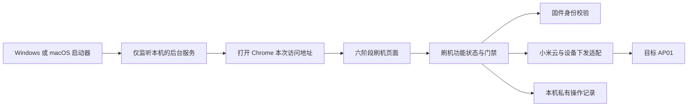

# 项目交付与 WebUI 刷机工具 DESIGN

本文对应 [`SPEC.md`](../SPEC.md) 中的文档合同、产品边界、MVP、WebUI 刷机、治理、总体验收和
版本维护条款。固件功能和制作规则只见
[`AP01 1.0.2_0031 优化固件 DESIGN`](AP01-1.0.2_0031-opt.bin.md)。

本项目采用的应用架构及模块归属规则只见
[`Architecture.md`](../Architecture.md)，本文不重新定义。
设计纠偏流程只见 [`design.md`](../design.md) 第 2 节。

## 1. 当前有效方案

| 项目 | 当前值 |
| --- | --- |
| 方案编号 | `WEB-002` |
| 状态 | 验证中 |
| 用户入口 | Windows 与 macOS 均由本机启动器打开 Chrome |
| 后台实现 | Python 3.9 或更高版本；本机网页服务使用标准库，小米云适配使用 `requirements.md` 已登记的 Requests |
| 页面实现 | 同一套本地网页结构、样式和交互资源，随发布包离线提供 |
| 刷机通道 | 复核并改造参考项目的小米云识别、文件上传、仅下载和正式安装能力 |
| 状态更新 | 页面每秒查询一次操作记录；没有直接证据的阶段不显示成功 |
| 写入保护 | 单活动操作、冻结设备与成品身份、严格模拟通过后自动上传回读并单次安装、未知状态只查询 |
| 凭据边界 | 账号、设备凭据、签名地址和网络地址只在后台内存或本机私有文件中使用 |
| 当前代码 | `features/web_firmware_flash/` 已实现二维码登录、六阶段页面、访问边界、设备与成品冻结、原子操作记录、云端上传完整回读、单次正式安装、只读上线观察、脱敏结果导出和双平台同源发布；`app/ap01_web.py` 已建立 |
| 下一验证 | 用发布候选完成 macOS 页面真实流程，并在 Windows 10/11 执行同一发布包验收 |

## 2. 文档传递与自动核对

承接 `SPEC-DOC-001` 至 `SPEC-DOC-004`、`SPEC-VERSION-001` 至 `SPEC-VERSION-003`。

- Brief 文件指纹、逐句定位符和 SPEC 条款编号由文档核对任务检查；
- SPEC 条款变化后，核对全部条款仍能在
  [`SPEC 到 DESIGN 实现矩阵`](SPEC到DESIGN实现矩阵.md) 中找到设计和验证落点；
- 代码、测试和案例引用稳定条款编号，不依赖章节序号；
- 开发需求、设备事实、依赖、操作步骤和视觉分别先更新各自唯一上游，再按
  [`design.md`](../design.md) 第 2 节进入设计与代码循环；
- 核对失败时停止发布，不自动改写 Brief、SPEC 或 DESIGN。

首轮文档核对任务放入 `features/document_contract_check/`，只负责“文档合同核对”这项可独立
验收的用户能力；入口由 `app/` 组合，不把文档规则散入刷机功能。

## 3. 产品交付边界

承接 `SPEC-PRODUCT-001` 至 `SPEC-PRODUCT-006`。

交付物分为三类：

| 交付物 | 内容 | 不包含 |
| --- | --- | --- |
| Windows 包 | 本机服务、同一套网页资源、启动器、运行环境和使用说明 | 源码、开发者路径、开发者账号 |
| macOS 包 | 本机服务、同一套网页资源、启动器、运行环境和使用说明 | 源码、开发者路径、开发者账号 |
| 固件成品 | 冻结且通过发布门禁的官方基线、阶段成品或完整优化版之一 | 账号凭据、设备凭据、服务端私有配置 |

两个系统只允许平台启动、文件选择和常驻方式不同。页面名称、六阶段顺序、按钮含义、状态值、
错误类别和结果结构必须相同。Chrome 无法打开或本机服务未就绪时，启动器显示一条可执行处置
提示并退出，不能要求普通用户输入项目内部命令。

## 4. 参考项目复用结论与模块落点

承接 `SPEC-GOV-001` 至 `SPEC-GOV-004`。

### 4.1 已核对的参考资产

参考项目固定为 `/Users/mac/Desktop/cuktech-screen-controller`。本轮只把下列内容作为复用来源：

| 参考资产 | 已证明的能力 | 本项目处理 |
| --- | --- | --- |
| `mi_login.py` | 小米二维码授权、登录态落盘和 AP01 唯一目标校验 | 复用前必须遵守 [`SOP/AP01-固件制作与刷机.md`](../SOP/AP01-固件制作与刷机.md) 第 0 节固定的远端版本、上游来源、测试和登录态边界；接入网页时只包装该流程，不另写授权协议 |
| `mi_cloud.py` | 小米云请求、设备列表、AP01 选择、当前固件查询和官方固件下载 | 复制进刷机功能后拆除命令行入口、固定默认值和全局状态；只通过功能内部接口使用 |
| `ap01_custom_ota.py` | 上传前探测、文件上传、仅下载和正式安装下发 | 复制进刷机功能后拆开上传、仅下载、正式安装和状态查询；每一步接入冻结身份和单次操作记录 |
| `ap01_install_firmware.py` | 已有命令行流程把上述能力串成一次安装 | 只参考调用顺序和测试场景，不复用用户入口 |
| `windows/runtime.py` | Windows 数据目录、原子写入、后台进程、健康检查和单实例经验 | 只复制经验证且无业务含义的必要部分，先留在刷机功能内部，出现第二个真实复用方后再抽取 |
| `windows/package-release.ps1`、`macos/package-release.sh` | 双平台发布包制作经验 | 改造成当前项目发布脚本，产物不得依赖参考项目路径 |

参考项目的 macOS 和 Windows 原生界面不满足本项目 Chrome 入口合同，因此不进入当前方案。
任何资产复制前先记录来源文件和版本；复制后必须通过本项目公开入口、测试和发布检查，运行时
不得读取参考项目目录。

### 4.2 模块归属

| 模块 | 职责 | 包含 | 依赖 |
| --- | --- | --- | --- |
| `features/web_firmware_flash/` | 完成普通用户一次 AP01 固件核对与安全刷机 | 网页资源、六阶段状态、设备识别、固件核对、风险确认、操作记录、参考资产适配、平台启动资源和测试 | `core/firmware_image/` 与 Python 标准库 |
| `app/ap01_web.py` | 启动本机服务、选择空闲本机端口、生成本次访问凭证并打开 Chrome | 参数转换和功能组合 | `features/web_firmware_flash/` |
| `app/ap01_firmware.py` | 继续提供开发者离线分析与制作入口 | 现有命令组合 | 现有固件功能模块 |

刷机功能不调用其他功能模块。固件制作、看板服务和文档核对由 `app/` 分别组合，避免功能之间
互相依赖。只有出现第二个已经验证的复用方后，才把无业务含义的平台能力提取到 `core/`。

当前实现由 `features/web_firmware_flash/` 统一提供安装决策、六阶段状态、原子操作记录、固件
身份核对和小米云适配，只接收由应用入口组合得到的本次操作、冻结身份、模拟结论、上传回读和
设备状态，不调用其他功能模块。输出动作只包括等待本次操作开始、运行模拟、上传回读、单次
安装、只查询或停止，不存在二次确认动作。自动测试覆盖模拟通过自动安装、模拟失败停止、客观
门禁变化停止、防重复下发、异常重启和发布内容检查。

## 5. 运行结构与本机安全边界

承接 `SPEC-PRODUCT-004` 至 `SPEC-PRODUCT-006`、`SPEC-FLASH-001`、
`SPEC-FLASH-008`、`SPEC-FLASH-009`。

首轮服务使用 `ThreadingHTTPServer`（Python 自带的并发本机网页服务类），只监听
`127.0.0.1`。它不在局域网公开页面，也不与设备端看板服务共用端口。

启动器每次生成至少 32 字节随机访问凭证，只把它放进本次 Chrome 地址。后台收到首次合法访问
后建立本次会话，后续修改类请求还必须带同一会话值。后台拒绝：

1. 不是本机来源的连接；
2. 不带本次会话值的请求；
3. 来源页面不属于本机服务的修改类请求；
4. 超过固定请求体上限的请求；
5. 不属于当前状态允许动作的请求；
6. 已有活动写入时创建第二个写入操作。

页面只接收脱敏后的设备名称、型号、版本、在线状态、成品类型、文件名、完整性结论、阶段状态和
处置提示。账号、设备内部编号、网络地址、签名地址、请求签名、凭据文件路径和原始响应不进入
页面、普通日志或导出结果。

## 6. 六阶段状态与本机接口

承接 `SPEC-FLASH-001` 至 `SPEC-FLASH-009`。

页面与后台通过 JSON（用键和值表达数据的文本格式）交换状态。首轮使用每秒一次的短查询，
避免额外引入长期连接依赖。全部响应具有 `operation_id`、`phase`、`status`、
`updated_at`、`evidence`、`allowed_actions` 和 `message`；字段缺失时前端显示“无法确认”。

### 6.1 用户阶段

| 页面阶段 | 后台状态 | 进入条件 | 允许动作 | 完成证据 |
| --- | --- | --- | --- | --- |
| 准备条件 | `prepare` | 本机服务启动 | 重试只读检查 | Chrome、网络、供电确认、私有目录和必要材料状态 |
| 识别设备 | `device` | 准备条件通过 | 登录、刷新设备、选择唯一目标 | 脱敏名称、型号、当前版本、在线状态和资格结论 |
| 核对固件 | `firmware` | 唯一设备冻结 | 选择发布包内成品、重新核对 | 成品类型、版本、长度、完整文件指纹、构建清单和门禁 |
| 风险确认 | `risk` | 设备与成品身份冻结 | 发起一次“制作并刷入”操作 | 当次授权记录绑定操作、设备和成品 |
| 执行刷机 | `execute` | 本次操作已发起 | 只查询；后台先运行严格模拟，通过后自动上传、完整回读并单次安装 | 模拟、上传、设备下载、安装、暂时离线、重新上线和验收分别记录 |
| 查看结果 | `result` | 到达成功、失败或无法确认终态 | 导出脱敏结果、按提示安全退出 | 已完成阶段、未确认阶段、停止原因和下一步 |

设备和成品在进入风险确认时冻结。返回修改任一身份会作废旧操作和旧确认，必须重新核对。

### 6.2 首轮本机接口

| 方法与路径 | 作用 | 写入设备 |
| --- | --- | --- |
| `GET /api/v1/session` | 读取当前页面阶段和允许动作 | 否 |
| `POST /api/v1/preflight` | 执行准备条件检查 | 否 |
| `POST /api/v1/device/login/start` | 生成本次小米账号登录二维码 | 否 |
| `GET /api/v1/device/login-qr` | 在本次会话内读取二维码图片 | 否 |
| `POST /api/v1/device/login/complete` | 等待扫码结果，核对唯一在线 AP01 后私有落盘登录态 | 否 |
| `POST /api/v1/device/identify` | 登录、取得并冻结唯一目标设备 | 否 |
| `POST /api/v1/firmware/inspect` | 从发布包允许目录选择并核对成品 | 否 |
| `POST /api/v1/operations` | 生成绑定设备与成品的单次操作 | 否 |
| `POST /api/v1/operations/{id}/start` | 记录本次“制作并刷入”授权；严格模拟通过后自动上传、完整回读并下发一次正式安装 | 是 |
| `GET /api/v1/operations/{id}` | 查询六类执行状态和证据摘要 | 否 |
| `GET /api/v1/operations/{id}/export` | 下载不含账号、设备内部编号和网络地址的结果 | 否 |

修改类接口必须同时检查当前阶段、允许动作、单次操作编号、冻结身份、访问会话和是否已经执行。
同一启动接口重复到达时只返回原操作状态，不再次下发。后台不得返回“等待安装确认”动作；严格
模拟通过后只允许自动进入上传，完整回读一致后只允许自动进入单次正式安装。

## 7. 操作记录、未知状态和恢复

承接 `SPEC-FLASH-005` 至 `SPEC-FLASH-009`。

### 7.1 操作记录

每次操作使用不可复用的随机编号。后台把下列非敏感信息原子写入本机私有目录：

- 成品类型、文件名、字节数和完整文件指纹；
- 设备脱敏标识、型号和刷机前版本；
- 每个阶段的开始时间、结束时间、状态和证据摘要；
- 严格模拟是否通过、正式安装是否已经下发；
- 最后一次确认到的在线状态、版本和功能验收结论；
- 停止原因和允许的下一步。

账号凭据、设备凭据、签名地址、网络地址和云端原始响应不写入该记录。服务意外退出后，若记录
表明某个写入可能已经下发，重启只能恢复到“状态未知”，不得自动重发。

### 7.2 执行子阶段

| 子阶段 | 成功所需直接证据 | 失败或未知时动作 |
| --- | --- | --- |
| 上传 | 上传对象完整回读后与冻结成品逐字节一致 | 停止，不向设备下发 |
| 设备下载 | 设备接受正式安装任务并报告下载进度，且查询未出现对应错误 | 停止，只允许查询 |
| 安装 | 正式安装指令只成功下发一次 | 不重复下发，只允许查询 |
| 暂时离线 | 已下发安装后观察到设备离线 | 继续有限时查询，不写入 |
| 重新上线 | 同一设备重新在线并报告可核对版本 | 进入功能验收 |
| 验收 | 本次成品对应功能和原厂能力均取得直接结果 | 保留未通过项，不显示总成功 |

查询达到固定总时限仍无法确认时，结果为“无法确认”，不是“失败后重试”。后续只能根据页面
提示重新读取设备现状或转入人工安全流程。

## 8. 双平台启动与发布包

承接 `SPEC-PRODUCT-002` 至 `SPEC-PRODUCT-006`、`SPEC-MVP-007`、
`SPEC-MVP-008`、`SPEC-FLASH-008`。

### 8.1 开发阶段

- macOS 先用仓库现有 Python 环境启动只读版本；
- Windows 用项目声明的最低版本和同一组测试启动只读版本；
- 两个平台加载完全相同的网页资源和状态样例；
- 写入动作在只读流程、状态恢复和敏感检查完成前保持编译期关闭。

### 8.2 发布阶段

Windows 发布包复用参考项目“携带隔离运行环境与双击启动器”的经验；macOS 发布包首轮复用
“创建隔离运行环境与双击启动器”的经验。两者最终都只启动本机后台并打开 Chrome，不安装原生
业务界面。

每个发布包固定包含：

1. 本机后台及其隔离运行环境；
2. 同一版本的网页资源；
3. 双击启动器；
4. 允许刷写的冻结成品和构建清单，或明确说明当前包只提供检查；
5. 用户说明、许可和版本信息；
6. 发布前生成的文件清单与完整文件指纹。

发布检查扫描包内文件名、文本内容、网页资源、日志样例、操作记录样例和构建脚本输出，拒绝
开发者路径、参考项目路径、账号与设备凭据、本机网络地址、签名地址、调试固件和未批准成品。

## 9. 测试设计

### 9.1 不接设备的自动测试

- 六阶段只能按允许方向迁移，不能跳过设备、固件、风险确认或严格模拟；
- 严格模拟通过后自动进入上传、完整回读和单次正式安装，状态中不存在二次确认动作；
- 严格模拟失败、设备身份变化、成品身份变化、回读不一致或设备非空闲时不下发安装；
- 任一冻结身份变化都会作废旧确认；
- 同一写入请求重复到达只执行一次；
- 后台在上传、下载或安装后异常退出，重启只查询；
- 页面不显示任何被列为敏感原值的字段；
- 三种固件身份、错误文件、错误长度、错误指纹和缺失构建清单均得到正确门禁；
- 页面刷新、浏览器关闭重开和后台重启后，操作状态不会倒退或变成虚假成功；
- Windows 与 macOS 状态样例产生相同页面文字、按钮和允许动作；
- 发布包不存在参考项目绝对路径或开发者私有内容。

### 9.2 双平台页面验收

在 Windows 10/11 64 位和项目锁定的 macOS 最低版本分别执行：

1. 双击启动；
2. Chrome 自动打开；
3. 本机服务未就绪、网络不可用、无设备、多设备、设备离线和错误固件提示；
4. 从准备条件到结果的完整只读演练；
5. 关闭页面后恢复当前操作；
6. 普通用户不查看源码、不输入内部命令即可完成处置。

### 9.3 真机写入验收

只有固件 DESIGN 第 4.3、11.2 节门禁满足，才在唯一目标设备依次执行：

1. 发起一次绑定设备与成品的“制作并刷入”操作；
2. 严格刷前交互模拟通过；
3. 自动完整上传回读；
4. 自动再次核对客观门禁并下发一次正式安装；
5. 暂时离线、重新上线、版本和本次成品功能验收；
6. 原厂页面、米家通信和官方更新回归；
7. 同一设备原厂回刷；
8. 两个平台使用同一发布候选各完成一轮页面验收。

## 10. MVP 与发布判定

承接 `SPEC-MVP-001` 至 `SPEC-MVP-009`、`SPEC-ACCEPT-001` 至
`SPEC-ACCEPT-006`。

发布汇总只读取下列独立结果，不用一个结果替代另一个：

| 结果组 | 来源 | 发布条件 |
| --- | --- | --- |
| 官方基线与固件制作 | 优化固件 DESIGN 和构建清单 | 当前官方基线、阶段成品、完整成品均具备匹配证据 |
| 三组固件功能 | 优化固件 DESIGN 和真机案例 | 一级页面开关、AGENTS 看板、系统设置旋钮分别通过 |
| 刷机全链路 | 本文第 6、7、9 节 | 唯一设备完成上传、仅下载、安装、上线和功能验收 |
| 双平台 WebUI | 本文第 8、9 节 | Windows 与 macOS 使用同一发布候选通过 |
| 安全与恢复 | 固件制作规范、SOP 和恢复案例 | 原厂能力回归、原厂回刷和规定恢复门禁通过 |
| 文档与隐私 | 文档核对和发布检查 | Brief、SPEC、DESIGN、代码一致且发布物无敏感内容 |

任一结果缺失、只属于历史成品、环境不匹配或证据失效时，总状态只能是“未通过”。

## 11. 纠偏记录

| 日期 | 方案 | 结果 | 后续 |
| --- | --- | --- | --- |
| 2026-07-30 | `WEB-000`：沿用参考项目的 macOS 与 Windows 原生界面 | 与 `SPEC-PRODUCT-004`、`SPEC-FLASH-001` 规定的 Chrome 入口冲突，设计审查已否定；未进入代码实测 | 改为 `WEB-001` 本机后台服务与同一套 Chrome 页面 |
| 2026-07-30 | `WEB-001`：标准库本机服务、短查询状态、单次写入和参考通信能力改造 | 当前拟定，尚未实现 | 先完成只读启动、准备检查、设备识别、固件核对和自动测试；验证通过后，再在修改 DESIGN 后接入仅下载 |
| 2026-08-01 | `WEB-002`：模拟通过后自动正式安装 | 用户明确要求模拟通过后直接刷机且不得二次询问；已实现无二次确认动作的自动推进合同，6 项定向测试通过 | 保留单活动操作、冻结身份、完整回读、未知状态只查询和单次下发；继续实现操作记录与云端安装适配 |
| 2026-08-04 | `WEB-002`：完整本机入口与发布实现 | 二维码登录、六阶段页面、操作恢复、唯一设备、成品清单、完整对象回读、单次安装、只读上线观察、脱敏结果导出、双平台启动文件、发布扫描和文档核对已实现；全项目 168 项自动测试通过 | 当前不安装未满足最终门禁的候选；后续只对批准候选执行真实网页流程和双平台页面验收 |

`WEB-001` 若在双平台实测中不能满足并发、文件上传或状态恢复要求，必须先把失败证据写入本表，
再拟定替代方案；不得直接更换服务框架后补文档。
