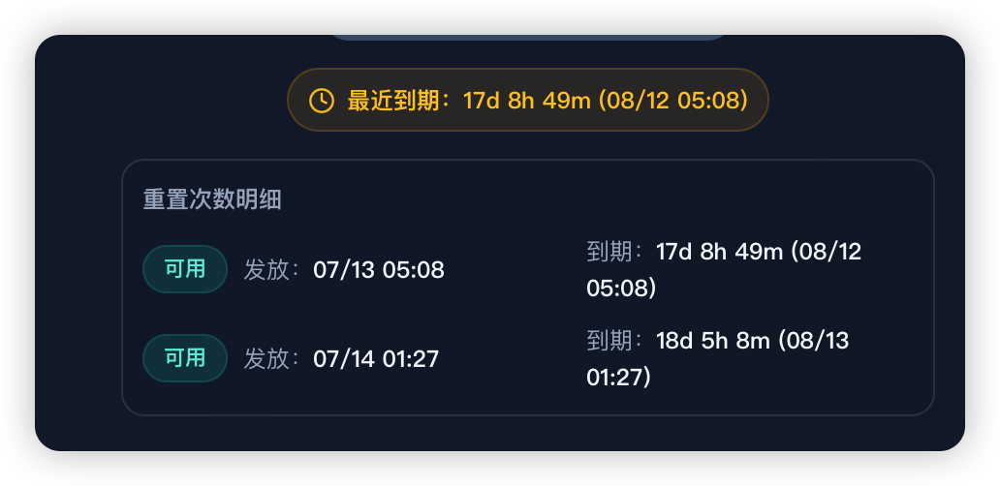

本文档用于记录开发需求。

---

我要开发的是酷态科10号电能基站 AP01屏幕的第三方固件制作和刷机工具。

本项目不仅给我个人使用，还要可以分享给其他的用户（注意隐私安全，不要泄露Codex卡密、米家登录态、AP01设备信息、米家账号信息等敏感内容），让他们可以便捷高效地、零基础、无门槛地使用。

为此，尤其要随时记录依赖项到专用文档（文档格式，参考/Users/mac/Desktop/cuktech-screen-controller/Depends.md。文档放在根目录），还要提前为WIN和macOS通用做好技术栈上的准备。项目优先在本机macOS上跑通，但要避免开发WIN版时需要大量地推倒重写。

## MVP

本项目的MVP是：基于官方最新固件（ap01-1.0.2_0031.bin），制作出一个优化版固件(ap01-1.0.2_0031-opt.bin)并完成刷机。

据此沉淀出固件制作规范和刷机的可靠工作流，固化出一个小白友好的Windows和macOS通用的AP01屏幕WebUI刷机工具。用户拿到固件后，在WEBUI点击一下，就能完成刷机。

随时沉淀固件制作规范，确保变砖风险降到最低。沉淀到knowledge/固件制作规范/。可参考的部分规范：/Users/mac/Desktop/cuktech-screen-controller/agent-docs/firmware-safety.md

### ap01-1.0.2_0031-opt.bin的工作

#### 01 支持隐藏官方一级页面

在系统设置菜单内新增一个<开关一级页面>选项，从而支持通过复选操作来决定首页是否日历、天气、萌宠等一级页面。

#### 02 新增1个第三方的一级页面。

名为<AGENTS看板>，该页面支持展示和刷新Codex使用信息。服务端提供Codex使用数据并生图，屏幕端定时取数据/图片到RAM并展示。

服务端支持WIN和macOS电脑、Linux NAS、Linux云服务器。确保服务端重启后，服务不受影响（自启动）。确保一次刷机，即可智能路由服务端，比如固件制作时，屏幕端的拉取策略是智能路由的，若服务端A不可达，自动尝试从服务端B获取数据，如此类推。

图片生成一律由Codex自动打开Web端的GPT，调用image2生成效果图。效果图审阅无误后，删文字（仅删除实时数据文字，其他文字标题可保留）、留底图，由服务端刷新数据时拿文字和底图拼成新图。

##### AGENTS看板-Codex使用信息

一级页面：概览

内容：（3个区块）

* 圆环：周剩余额度数字圆环；
* 卡片：今日&近30天消耗；
* 曲线：近七天消耗折线图

二级页面X3：周剩余额度详情、今日消耗详情、近30天消耗详情

内容：

1. 周剩余额度详情页
   * 本周剩余（进度条+百分比数字)+下次重置（倒计时+重置时间）；
   * 重置卡的张数+每张重置卡的详情（过期倒计时、发放时间、到期时间）
2. 今日消耗详情页
   * 总消耗Token
   * 请求数+总成本
   * 输入、输出、缓存命中
3. 近30天消耗详情页
   1. 近30天累计
   2. 最长任务时长；
   3. 活动洞察、常用插件

交互逻辑：

上述一二级页面，支持原厂级的物理旋钮交互（原厂支持的交互见knowledge/AP01-物理旋钮交互设计）。

按下松开。位于<AGENTS看板>一级页面的时候，单击旋钮，进入二级页面。二级页面默认为周剩余额度详情页

左右旋转。循环切换到其他二级页面。今日消耗详情页、近30天消耗详情页。

按下松开。返回一级页面。

#### 03 优化系统设置页的物理按钮交互逻辑

目前原厂的左旋转只能旋转到顶部的屏幕常亮选项，右旋转只能旋转到底部的返回选项。

现在我要求，无论是左旋转还是右旋转都能够循环选择菜单项。比如说，左旋转到顶部之后，如果再左旋转，它就跳转到底部并支持继续左旋向上选择。

---

## Research

这个参考项目已经跑通了固件下载、固件制作、刷机的全流程。参考项目：/Users/mac/Desktop/cuktech-screen-controller）

AI在规划本项目时，可以优先参考。除非参考项目、成熟开源，都没有可复用的资产，AI才可以自己造轮子。使用其他项目的资产时，必须按照我指定的 FCMA 架构改造。

当你要用到该参考项目的任何内容时，必须复制一份到本项目的合适目录下，再具体调用。开发结束后，该参考项目会直接删除。
