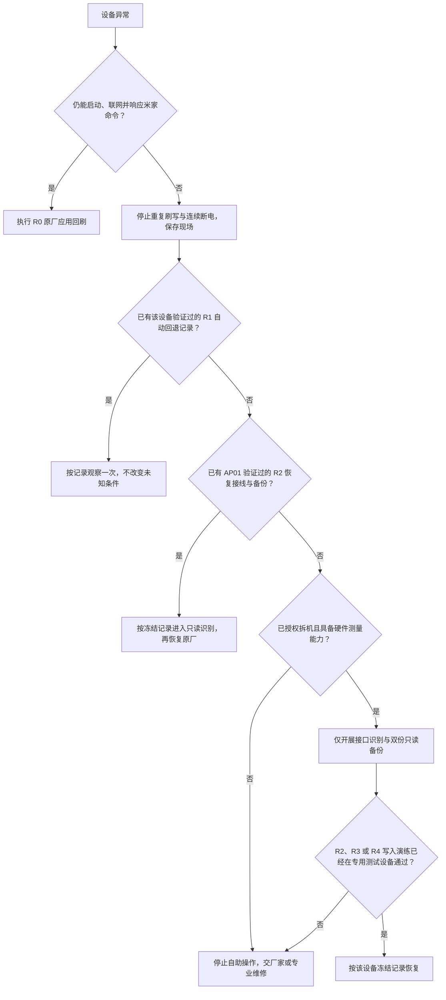

# AP01 分级恢复与救砖操作规程

## 1. 适用范围

本文只规定 AP01 恢复决策、操作顺序、证据和停止条件。恢复层级、接口术语、应用更新包与
全闪存备份的定义只见
[`AP01 离线恢复与救砖证据`](../../knowledge/AP01-官方固件分析/离线恢复与救砖证据.md)。

当前没有 AP01 专属下载焊盘、调试焊盘、分区地址或外置闪存接线证据。本文不会给出猜测
接线和猜测写入命令。取得这些直接证据后，先更新知识文档与
[`固件制作规范`](../固件制作规范.md)，再补充对应步骤。

## 2. 恢复决策

任何时候只允许进入证据已经覆盖的层级。下一层“理论上可能存在”不能作为继续写入的理由。

## 3. 首次实验安装前的自救验证

### 3.1 测试设备与材料

1. 只使用明确标记的专用测试设备，不使用日常使用设备；
2. 记录整机型号、硬件批次、当前版本、账号归属和设备在线状态；
3. 准备与当前版本严格匹配的原厂应用更新包，核对
   [`固件制作规范`](../固件制作规范.md) 第 4 节全部固定值；
4. 准备稳定供电、限流电源、高阻测量表和逻辑分析仪；
5. 拆机、焊接、短接、连接调试器和任何写入动作分别取得当次明确授权；
6. 所有备份和日志保存在仓库外，至少保留两个独立副本。

### 3.2 先验证 R0

设备仍处于原厂状态时：

1. 查询当前版本、在线状态和运行时间；
2. 上传匹配原厂应用更新包，并把上传对象完整下载回来重新计算文件指纹；
3. 证明回读对象与冻结原厂包逐字节一致；
4. 取得本次安装确认后回刷原厂应用更新包；
5. 保存安装阶段、重启、运行时间重新计数和重新上线证据；
6. 验证原厂页面、米家通信和官方更新能力。

本步骤通过只证明 R0 可用，不解除独立恢复门禁。

### 3.3 只读识别硬件恢复通道

取得拆机授权后：

1. 把 AP01 屏幕与充电底座、市电和 USB-C 供电全部分离；
2. 拆机前拍摄整机状态，拆机后拍摄主板正反面、排线方向、板号、芯片丝印和全部测试点；
3. 断电并确认储能已经释放，再用通断测量确认地线；
4. 正常供电时用高阻探头测量候选点，不把电脑电压送入未知点；
5. 用逻辑分析仪被动记录上电、复位和联网期间的波形；
6. 串口适配器的供电脚不得连接 AP01，只在信号、电平和地线全部确认后连接必要信号；
7. 只有波形、芯片资料和主板走线能相互印证时，才把候选点记为串口、复位或启动选择信号；
8. 任何候选点超过调试器允许电平、波形相互冲突或主控型号不明时停止。

禁止按五个弹簧触点的排列、接口外形、焊盘位置或开发板图纸猜测信号。

### 3.4 双份全闪存备份

只有 AP01 接口、主控、闪存身份和真实容量均已确认，且官方工具只读连接成功后才执行：

1. 记录读取工具的文件指纹、版本、接口配置、供电限制和完整读取范围；
2. 完整读取一次，立即将文件设为只读并计算两个文件指纹；
3. 设备断电，复核接线，再完整读取第二次；
4. 两份读取结果逐字节比较；
5. 不一致时停止，排查供电、接线、读取范围和闪存容量，不做写入；
6. 一致时分别保存到两个独立位置，并记录该备份只属于这台设备。

只读阶段禁止点击或调用写入、擦除、整片擦除和一次性配置功能。

### 3.5 独立恢复演练

双份备份一致后，仍需在专用测试设备上另行确认写入演练：

1. 从只读结果取得并复核 AP01 真实分区图；
2. 明确当前应用槽、非当前应用槽、两份分区表、第二阶段启动程序、资源区、校准区和设备
   专属数据；
3. 先备份准备写入的精确地址范围；
4. 只对已经证实的应用槽写回该设备自己的原厂内容；
5. 写后立即完整读回并逐字节比较；
6. 退出硬件恢复状态并启动设备；
7. 完成原厂页面、联网、米家通信、设备身份和官方更新验收；
8. 保存“应用没有运行时进入恢复通道—写回—启动—验收”的完整证据。

不得为了制造故障而破坏第二阶段启动程序、分区表或当前正常槽。只有本节完整通过，R2、R3
或 R4 中对应层级才能写为“已经实测”。

## 4. R0：设备仍在线时刷回原厂

### 4.1 前提

- 设备可以正常启动、联网并响应米家在线更新命令；
- 目标设备和当前版本可以唯一确认；
- 匹配原厂应用更新包已经通过来源、字节数和文件指纹校验；
- 原厂包上传对象完整回读已经成功。

### 4.2 操作

1. 停止所有新功能请求和并行设备命令；
2. 保存设备版本、运行时间、在线状态和当前更新状态；
3. 确认本次回刷的目标设备、原厂文件指纹和已知限制；
4. 取得本次回刷确认；
5. 下发一次安装，不重复下发；
6. 依次观察下载、安装、离线、重启、运行时间重新计数和重新上线；
7. 完成第 8 节验收。

### 4.3 停止条件

- 设备不能再响应在线更新；
- 下载校验失败；
- 当前版本、设备身份或原厂文件不匹配；
- 状态未知、供电或网络不稳定；
- 一次安装命令后长时间无确定结果。

停止后不得盲目重复命令。R0 不能恢复启动程序、分区表、联网路径或两个应用槽同时损坏。

## 5. R1：设备自身回退

当前只允许观察，不允许按猜测制造故障或反复断电触发：

1. 保存上一次安装成品、文件指纹、安装时间和最后在线状态；
2. 只按已经在同硬件批次验证的等待时间和复位方法观察；
3. 若设备重新上线，读取当前版本和当前槽，验证是否确实回到原厂；
4. 无验证记录时不连续通断电、不连续复位，也不假定设备会自动切槽；
5. 一次观察后仍离线，转入已验证的 R2、R3、R4 或厂家维修。

## 6. R2：芯片固化启动程序串口恢复

当前状态：芯片家族资料存在，AP01 接线未证实，因此本节目前只能用于门禁判断。

允许执行写入的全部前提：

- AP01 主板的地线、串口收发、启动选择和复位信号均由本机测量确认；
- 信号电平与调试器匹配；
- 已用同一接线稳定完成芯片识别和两次全闪存读取；
- 已取得 AP01 真实分区图；
- 已有同批次测试设备的成功恢复记录；
- 本次写入范围和文件指纹已经再次确认。

恢复时只写已经确认的原厂应用槽，写后逐字节读回。不得套用官方开发板的引脚、串口号、
分区地址或“地址零开始写入”示例。

## 7. R3 与 R4：拆机深度恢复

### 7.1 R3 调试接口

只有 AP01 实际调试焊盘映射、芯片调试状态和电平已经证实时才使用。先暂停芯片并读取身份、
寄存器和闪存，不先执行擦除。若调试被锁定，不尝试写入一次性配置或绕过安全设置，转厂家
维修。

### 7.2 R4 外置闪存或厂家维修

普通用户到达 R4 时停止自助操作，连同设备、原厂文件指纹、最后成品和故障记录交厂家或
专业维修。

具备芯片返修条件的自助者还必须先确认：

- 闪存是芯片内置还是外置；
- 外置芯片准确型号、供电、封装和在电路读取影响；
- 是否必须拆下芯片；
- 两份全芯片读取结果是否一致；
- 该备份是否来自同一台设备；
- 写回范围是否会覆盖校准、身份或密钥。

任一项未知时停止。不得用网络下载的整片镜像或另一台设备备份覆盖当前设备。

## 8. 恢复成功验收

恢复后必须逐项保存：

1. 设备可以稳定启动，运行时间从本次启动重新计数；
2. 型号、设备身份和原厂版本正确；
3. 原厂六个一级页面和设置可正常使用；
4. 无线网络可以重新连接；
5. 米家可以发现、控制并读取设备状态；
6. 底座数据和旋钮输入正常；
7. 官方在线更新状态可查询；
8. 至少连续完成三次正常冷启动；
9. 读回关键恢复范围与预期文件一致；
10. 故障、恢复动作和验收结果形成案例记录。

只看到屏幕点亮、串口有输出或设备短暂上线，均不能判定恢复成功。

## 9. 故障现场记录

发生异常后立即记录：

| 项目 | 内容 |
| --- | --- |
| 目标设备 | 型号、硬件批次、唯一标识记录位置 |
| 原运行状态 | 原厂版本、当前槽、运行时间、在线状态 |
| 安装成品 | 文件名、字节数、两个文件指纹、修改清单 |
| 最后成功阶段 | 上传、仅下载、安装、重启或重新上线 |
| 可见现象 | 屏幕、指示、声音、米家状态和网络状态 |
| 已做动作 | 每次命令、复位、断电、接线和时间 |
| 供电与接线 | 电压、电流限制、测量点和照片 |
| 原始日志 | 不裁剪的工具输出与设备状态记录 |
| 当前停止原因 | 对应本文具体停止条件 |

未知状态下，记录比重复尝试更重要。
