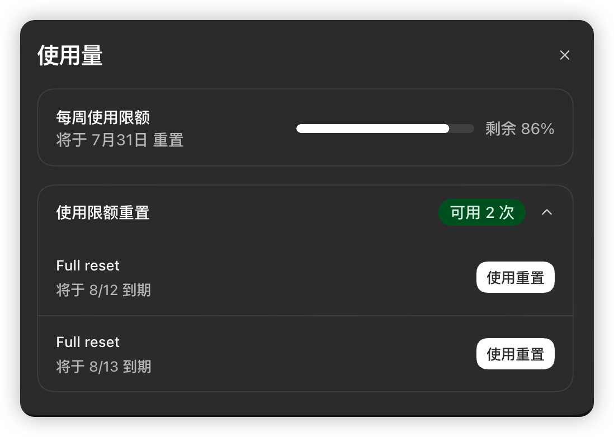
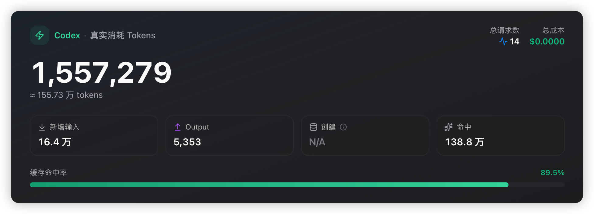
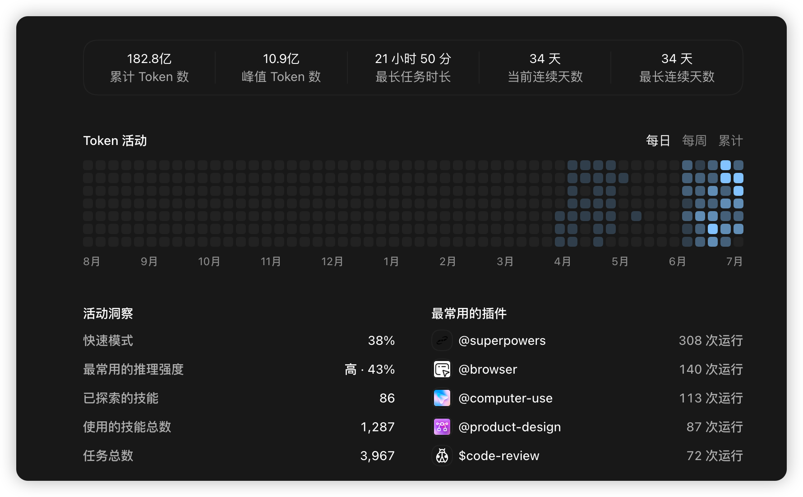

# 酷态科 10 号电能基站 AP01 第三方固件制作与刷机工具

本文档只记录开发需求。

## 1. 项目目标

开发酷态科 10 号电能基站 AP01 屏幕的第三方固件制作和刷机工具。

本项目不仅供个人使用，还要能够分享给其他用户，让零基础用户便捷地使用。发布内容不得
泄露 Codex 卡密、米家登录态、AP01 设备信息、米家账号信息等敏感内容。

项目优先在本机 macOS 上跑通，同时为 Windows 通用做好准备，避免开发 Windows 版本时
大量推倒重写。

普通用户版使用 Chrome（谷歌浏览器）打开 WebUI（浏览器中的操作界面）。

## 2. MVP

本项目的 MVP（最小可用版本）是：

1. 下载并通读小米云提供的 AP01 官方最新固件；
2. 基于官方最新固件制作优化版固件；
3. 完成优化版固件刷机；
4. 沉淀固件制作规范和可靠刷机工作流；
5. 固化为 Windows 和 macOS 通用、零基础用户可以操作的 AP01 WebUI 刷机工具；
6. 用户在 WebUI 中点击一次即可完成刷机。

当前官方最新固件为 `ap01-1.0.2_0031.bin`，当前优化版目标文件为
`ap01-1.0.2_0031-opt.bin`。

优化版固件只在官方最新固件上完成下列开发需求，不全面重写原厂固件。

## 3. 优化版固件开发需求

### 3.1 支持隐藏原厂一级页面

在系统设置菜单内新增“开关一级页面”选项，通过复选操作决定是否显示日历、天气、萌宠等
原厂一级页面。

### 3.2 新增 AGENTS 看板一级页面

新增一个名为“AGENTS 看板”的第三方一级页面，展示和刷新 Codex 使用信息。

服务端提供 Codex 使用数据并生成图片，AP01 每 5 分钟取得一次数据或图片到
RAM（断电后会清空的临时内存）并显示。

断网或服务端不可达时，AP01 显示最后一次成功取得的数据，不在屏幕上报错。

服务端支持：

- Windows 电脑；
- macOS 电脑；
- Linux NAS（运行 Linux 的网络存储设备）；
- Linux 云服务器。

服务端在系统重启后自动运行。一次刷机后，AP01 可以按顺序尝试多个服务端；当前服务端
不可达时，自动尝试下一个服务端。

图片由 Codex 自动打开网页端 GPT，调用 image2 生成效果图。效果图审阅通过后，只删除
实时变化的数据文字，保留标题和视觉底图，由服务端把实时数据与底图合成新图。

设计图只用于参考本节所列数据的显示方式，不要求显示设计图中的其他数据。

#### 3.2.1 一级页面：概览

概览显示三个区块：

- 圆环：本周剩余额度；
- 卡片：今日消耗、近 30 天消耗；
- 曲线：近 7 天消耗。

#### 3.2.2 二级页面

二级页面共三个：

1. 周剩余额度详情
   - 本周剩余：进度条和百分比；
   - 下次重置：倒计时和重置时间；
   - 可用重置次数；
   - 每次重置记录：过期倒计时、发放时间和到期时间。
2. 今日消耗详情
   - 总消耗 Token（模型处理文字时计算用量的单位）；
   - 请求数；
   - 总成本；
   - 输入、输出和缓存命中。
3. 近 30 天消耗详情
   - 近 30 天累计消耗；
   - 最长任务时长；
   - 活动洞察；
   - 常用插件。

设计参考：

- 周额度与重置记录：
  
  
- 今日消耗：
  
- 近 30 天消耗：
  

#### 3.2.3 物理旋钮交互

上述一级页面和二级页面支持原厂级物理旋钮交互。原厂交互见
[`AP01 物理旋钮原厂功能映射表`](../knowledge/AP01-物理旋钮交互设计/AP01-物理旋钮原厂功能映射表.md)。

- 在 AGENTS 看板一级页面按下并松开旋钮，进入二级页面；
- 第一次进入二级页面时显示“周剩余额度详情”；
- 在二级页面左右旋转，循环切换三个详情页；
- 在二级页面按下并松开旋钮，返回 AGENTS 看板一级页面。

### 3.3 优化系统设置页的旋钮交互

原厂系统设置菜单左旋只能到顶部，右旋只能到底部。优化后，左右旋都能循环选择菜单项：

- 左旋到顶部后继续左旋，跳到菜单底部并继续向上选择；
- 右旋到底部后继续右旋，跳到菜单顶部并继续向下选择。

## 4. 研发约束

项目依赖项统一记录并持续维护在根目录 [`Depends.md`](../Depends.md)。

参考项目：

`/Users/mac/Desktop/cuktech-screen-controller`

参考项目已经跑通固件下载、固件制作和刷机全流程。规划与开发时优先复用该项目和成熟开源
项目中的现有能力，没有可复用资产时再自行开发。

使用参考项目中的内容前，先复制到本项目的合适目录，再按照
[`Architecture.md`](PRD/Architecture.md) 中声明的 FCMA（按用户功能组织代码的模块化架构）
改造。本项目开发结束后会删除参考项目，因此本项目不得在运行时依赖参考项目路径。

固件制作规范持续沉淀到 `knowledge/固件制作规范/`，可参考
`/Users/mac/Desktop/cuktech-screen-controller/agent-docs/firmware-safety.md`。
