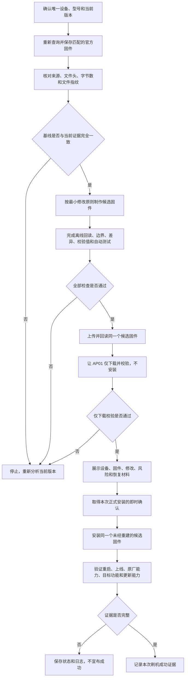

# AP01 固件制作与刷机安全规则

本文档规定 AP01 固件制作、校验、上传、仅下载、正式安装和恢复必须遵守的安全门槛。
具体操作步骤见 [`SOP/AP01-固件制作与刷机.md`](SOP/AP01-固件制作与刷机.md)，固件身份与功能
合同见 [`SPEC.md`](SPEC.md)，已经取得的设备与固件证据见
[`knowledge/`](../knowledge/README.md)。

本文档只采用当前精确型号、固件版本和直接证据能够支持的结论。未经真机验证的恢复能力
不得写成已经可用。

## 1. 风险状态

| 状态 | 会不会写入设备固件 | 允许的结果描述 |
| --- | --- | --- |
| 离线分析或制作 | 不会 | 已分析、已构建或离线校验通过 |
| 上传固件 | 不会 | 固件已经上传并完成回读校验 |
| 仅下载校验 | 不会安装，不切换启动区域 | 设备已经下载并接受校验 |
| 正式安装 | 会 | 只有完成安装后全部验收，才能写刷机成功 |
| 回退或恢复 | 会 | 只有使用匹配官方固件完成全流程，才能写回退成功 |

离线构建成功、文件上传成功、设备下载成功和屏幕亮起，都不能单独代表刷机成功。

## 2. 强制工作流

任何停止节点都不得通过反复安装、反复断电或跳过检查强行继续。

## 3. 制作前恢复基线

正式制作前必须：

1. 唯一确认目标设备是 `njcuk.enstor.ap01`，并记录当前固件版本和在线状态；
2. 从小米云重新查询当前官方最新固件，不依赖旧查询结果；
3. 保存未经修改且与目标设备匹配的官方固件；
4. 记录官方来源、版本、字节数、MD5（快速核对文件是否相同的指纹）和
   SHA-256（更严格核对文件是否相同的指纹）；
5. 准备使用官方固件执行仅下载校验和正式安装所需的同一条恢复路径；
6. 确认设备仍能联网、仍能通过米家通信并能查询更新状态。

官方版本、字节数或文件指纹与当前证据基线不一致时，必须停止使用已有地址、偏移和修改
结论，重新通读并分析该版本固件。

当前没有直接证据证明 AP01 具备可用的自动回滚、双启动区域保护、按键恢复或免拆硬件恢复。
不得把这些能力写入恢复承诺。

## 4. 固件修改边界

- 每个候选固件只包含已经写入 SPEC 和 design 的功能；
- 每个固件功能必须声明支持的精确官方版本和允许修改的字节范围；
- 不猜测地址、偏移、调用规则、内存布局、资源布局或分区布局；
- 默认不修改启动引导、恢复区域、分区表、网络初始化、米家通信和官方更新链路；
- 修改可能影响启动、联网、米家通信或更新能力时，没有已验证恢复通道不得安装；
- 每轮实验只增加一个可以独立验证的最小变化；
- 优先保留并调用原厂逻辑，自定义数据缺失或执行失败时不得破坏原厂基础功能；
- 已经写入载荷的固件不得再次交给会覆盖相同资源区或载荷区的工具处理；
- 原始官方固件、候选固件和最终固件必须使用不可混淆的文件名，禁止原地覆盖。

## 5. 安装前离线门槛

候选固件必须同时通过：

1. 文件头、精确字节数、尾部长度和全部已知校验值检查；
2. 所有修改区间逐字节回读；
3. 修改范围外没有意外差异；
4. 载荷边界、资源边界、挂接目标、跳转目标和调用规则检查；
5. 构建产物不存在未解决的外部引用或重定位；
6. 对应自动测试；
7. 输入文件、输出文件、修改区间、构建参数和文件指纹写入构建清单。

任何一项不确定或失败，都不得上传到设备。

## 6. 仅下载门槛

- 只上传已经完成全部离线检查的候选固件；
- 上传后必须回读并核对文件头与文件指纹；
- 仅下载和正式安装必须使用逐字节相同的文件；
- 仅下载完成后保存设备接受指令、下载进度和校验结果；
- 仅下载失败、超时或状态无法判断时停止，不下发正式安装；
- 从仅下载到正式安装期间不得重新构建、重新打包或覆盖候选固件。

## 7. 正式安装即时确认

真正安装前必须向用户展示：

- 唯一目标设备；
- 当前版本和目标固件；
- 目标固件文件指纹；
- 本次修改范围和功能清单；
- 已通过的离线与仅下载检查；
- 主要风险；
- 已准备的官方固件和恢复路径。

用户必须针对这一次目标设备、这一个固件文件进行即时确认。早先的概括授权、其他固件的
授权或仅下载授权不能替代本次正式安装确认。

安装期间保持设备稳定供电和联网，不拔电、不复位、不切换网络，不并行下发其他设备命令。

## 8. 安装后成功标准

必须分别保存以下证据：

1. 设备接受安装指令；
2. 固件下载完成；
3. 设备进入安装阶段；
4. 设备发生重启；
5. 运行时间重新计数；
6. 设备重新上线；
7. 米家通信正常；
8. 原厂基础页面和基础功能正常；
9. 本次目标 Feature 逐项通过对应 SPEC 验收；
10. 官方更新能力正常。

证据不完整时，不得宣布安装成功。

## 9. 失败与恢复

- 设备仍在线但目标功能异常时，优先评估使用已保存的匹配官方固件进行云端回退；
- 回退同样必须先完成官方固件的离线检查、仅下载校验和即时确认；
- 设备无法联网时立即停止重复刷机和连续断电，保存最后状态、日志、候选固件及文件指纹；
- 拆机、短接、连接调试器或直接写存储芯片属于新的高风险操作，必须另行制定接线、备份和
  恢复方案，并再次取得明确授权；
- 本项目在指定设备上完成官方固件回退全流程前，不得宣称“一键回退已经可靠”。

## 10. 强制停止条件

出现任一情况立即停止后续高风险操作：

- 设备身份、型号或当前版本不能唯一确认；
- 官方固件来源、字节数或文件指纹不能确认；
- 没有保存匹配的官方恢复固件；
- 修改范围外出现差异；
- 载荷、资源、跳转或调用规则不能证明正确；
- 恢复校验值不一致；
- 供电或网络不稳定；
- 上传回读结果与本地候选固件不一致；
- 仅下载校验失败；
- 正式安装后设备没有重新上线；
- 原厂基础功能、米家通信或官方更新能力异常；
- 任何人要求跳过检查、即时确认或安装后验收。
