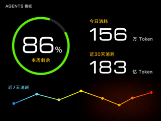
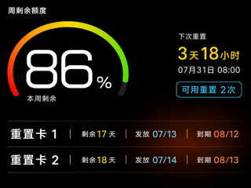
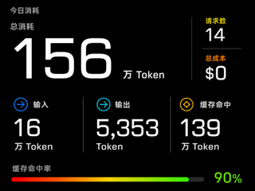
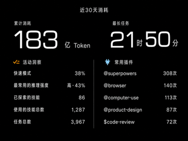
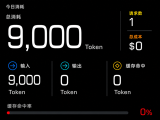
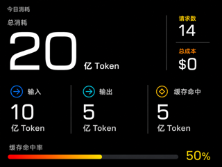

# AP01 AGENTS 看板效果图评审

## 1. 文档边界

页面字段与交互要求只见
[`brief.md` 第 3.2 节](../../../brief.md#32-新增-agents-看板一级页面)，技术实现只见
[`AP01 1.0.2_0031 优化固件 DESIGN` 第 7 节](../../../DESIGN/AP01-1.0.2_0031-opt.bin.md#7-agents-看板页面)。
本文只固定第 1 版视觉方向、评审图片和生成提示，不增加或改写功能要求。

| 项目 | 当前状态 |
| --- | --- |
| 内容核对 | 已按整数、Token 单位、圆环语义、颜色方向和分组图标完成修正 |
| 视觉评审 | 待用户审阅本轮四张效果图和两张边界排版图 |
| 数据性质 | 全部为示例数据，不含用户真实数据 |
| 画布 | 四张均为 320×240 |
| 固件状态 | 不是固件内置资源，不授权构建、仅下载或安装 |

数值显示和圆环语义以
[`SPEC` 第 4.1 节](../../../SPEC.md#41-看板数值显示合同)为准。效果图不得出现小数点，
不得在没有百分比总量的 Token 绝对值外绘制圆环。

## 2. 视觉方向

本项目看板视觉方向只在本节定义。视觉依据是原厂固件内的两张 320×240 完整画面资源：

| 原厂页面 | 固件文件偏移 |
| --- | --- |
| 功率 | `0x004a2f38` |
| 时间 | `0x004aced8` |

效果图必须沿用两张原厂一级页面的共同视觉语言：

- 使用纯黑全屏背景，不绘制设备外框、底部导航或整页容器；
- 主数值使用超大白色几何数字，单位明显缩小，优先占据页面视觉中心；
- 圆环只用于有明确总量的百分比；Token 绝对值使用普通数值和独立单位位置；
- 次要状态可以使用圆形底或紧凑状态块，不把每项数据包进独立卡片；
- 点缀色取自原厂页面的黄色、青色、橙色和红色，并补充原厂时间页已有的绿色；
- 表示剩余额度、命中率等“数值越高越好”的圆环和进度条，颜色方向固定为低值红色、
  中值橙黄、高值绿色；使用渐变时按数值增长方向依次经过红、橙、黄、绿，使用单色时按
  当前数值从同一方向取色，未完成部分使用暗灰色。纯趋势曲线不表达好坏，不使用这套映射；
- 标签使用紧凑的白色或浅灰色窄体字，标题弱于主数值；
- 分区优先依靠留白、对齐和少量细线，不使用密集边框、阴影和层层嵌套；
- “活动洞察”标题只使用一个活动或任务含义图标，“常用插件”标题只使用一个抽象插件
  图标；两组的数据行都不绘制图标、圆环或重复装饰；每行字段名、数值和单位统一使用
  同一种浅灰白文字颜色，不用点缀色区分数值；
- 可在页面右下区域使用原厂功率页同类的低亮度橙红光晕，但不得影响文字；
- 优先保证 320×240 下的主数字和关键状态，避免细小坐标轴与长段说明。

其他文档需要描述看板视觉方向时，只引用本节，不另行定义。

## 3. 当前效果图

### 3.1 概览

### 3.2 周剩余额度详情

### 3.3 今日消耗详情

### 3.4 近 30 天消耗详情

## 4. Token 边界排版验证

以下两张图片只验证同一页面在极端数据下的文字位置，不是第五、第六个看板页面。

### 4.1 今日消耗为 9,000 Token

主数值切换到较小的预设字号，保持既有基线和数值位置右边界；单位仍位于独立位置，右侧
请求数和总成本不移动。

### 4.2 今日消耗为 20 亿 Token

总消耗显示 `20 亿 Token`，输入显示 `10 亿 Token`，输出显示 `5 亿 Token`；数值和单位
分别占用固定位置，不显示原始十位数字串。

## 5. 生成提示

四张图片共同使用以下提示：

> 为 AP01 的 320×240 横向屏幕生成可交付的全屏效果图。严格参考原厂时间页和功率页：
> 纯黑背景、超大白色几何数字、顶部圆形或圆弧指标、黄色青色橙色红色点缀、紧凑窄体标签、
> 少量状态块与低亮度橙红光晕。不得使用通用仪表盘式卡片网格、密集边框、阴影、设备外框、
> 触控控件、导航栏、商标或水印。所有数据必须是整数，不得显示小数点；Token 数值和单位
> 必须分开放置并遵守 SPEC 第 4.1 节。剩余额度和命中率等高值更好的比例指示必须按数值
> 增长方向使用红、橙、黄、绿的颜色顺序，不得反向。

各页附加提示：

1. 概览：本周剩余额度使用百分比圆环；今日消耗与近 30 天消耗使用两个普通整数数值，不
   绘制圆环；底部显示无坐标轴的近 7 天曲线；每项数据只出现一次；
2. 周剩余额度：左侧使用超大百分比和渐变圆弧，右侧显示下次重置倒计时、时间与可用重置
   次数，底部使用两条无卡片边框的重置记录；圆弧从低值红色过渡到高值绿色；
3. 今日消耗：总消耗使用超大整数和独立 Token 单位，请求数与总成本使用紧凑状态，输入、
   输出和缓存命中各自显示整数和 Token 单位，底部使用整数命中率进度；进度从低值红色
   过渡到高值绿色；
4. 近 30 天消耗：顶部使用整数和独立 Token 单位显示累计消耗，以整数时分显示最长任务；
   下方以一条细线分成左右两列，左侧依次显示五项活动洞察，右侧显示五个常用插件的原名
   和运行次数；两个组标题各使用一个不同的语义图标，所有数据行不绘制图标或圆环，字段
   名、数值和单位统一使用同一种浅灰白。不得显示方格活动图或活跃天数。

边界排版图沿用今日消耗页提示，只替换为第 4 节列出的测试数据，并要求保持数值位置右边界、
基线和单位位置不变。

## 6. 文件检查

| 文件 | 像素 | 字节数 | 完整文件指纹 |
| --- | --- | ---: | --- |
| `01-概览-v5.png` | 320×240 | 53,981 | `8f26bd3b918de23fdc7a75b375a9ef46f46c4c267d4ede69d63f3a4d64910743` |
| `02-周剩余额度-v3.png` | 320×240 | 64,799 | `cf3e700a0ce5306d20fde134df4c410ebc37652a3b5d0968fb9535bc14b4597d` |
| `03-今日消耗-v4.png` | 320×240 | 47,857 | `9515ff9cf02e27ddcd6129efe58a9266fce8a5600e5e8c7d290095df5e6d3148` |
| `04-近30天消耗-v5.png` | 320×240 | 45,490 | `0b95b63240f0c00e9c62bc816a79d56e563e93621b78b297fc25c19f7af63ad5` |
| `边界测试/03-今日消耗-9000-token-v1.png` | 320×240 | 41,510 | `c831c45e787707fdda720fbef6e1d43345775fc34d80176d7e121400626df3d9` |
| `边界测试/03-今日消耗-20亿-token-v1.png` | 320×240 | 41,239 | `b5623577beafc22345876f8a78f9a17ef2b5c402e8e5342d33666afd2a0c7ead` |

用户批准前，不从这些效果图派生无数据底图、页面渲染代码或固件资源。
