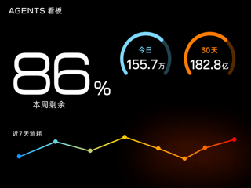
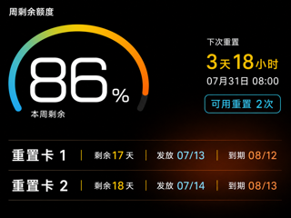
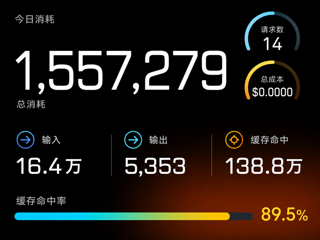
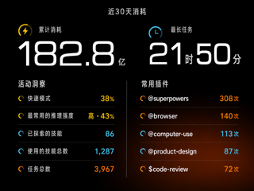

# AP01 AGENTS 看板效果图评审

## 1. 文档边界

页面字段与交互要求只见
[`brief.md` 第 3.2 节](../../../brief.md#32-新增-agents-看板一级页面)，技术实现只见
[`AP01 1.0.2_0031 优化固件 DESIGN` 第 7 节](../../../DESIGN/AP01-1.0.2_0031-opt.bin.md#7-agents-看板页面)。
本文只固定第 1 版视觉方向、评审图片和生成提示，不增加或改写功能要求。

| 项目 | 当前状态 |
| --- | --- |
| 内容核对 | 已完成，四张页面不存在根本内容错误 |
| 视觉评审 | 待用户审阅原厂时间页、功率页风格修订版 |
| 数据性质 | 全部为示例数据，不含用户真实数据 |
| 画布 | 四张均为 320×240 |
| 固件状态 | 不是固件内置资源，不授权构建、仅下载或安装 |

用户已确认概览、周剩余额度详情和今日消耗详情不存在根本内容错误。近 30 天消耗详情已
按第 4 节的内容修正，四张页面的内容核对完成。

## 2. 视觉方向

本项目看板视觉方向只在本节定义。视觉依据是原厂固件内的两张 320×240 完整画面资源：

| 原厂页面 | 固件文件偏移 |
| --- | --- |
| 功率 | `0x004a2f38` |
| 时间 | `0x004aced8` |

效果图必须沿用两张原厂一级页面的共同视觉语言：

- 使用纯黑全屏背景，不绘制设备外框、底部导航或整页容器；
- 主数值使用超大白色几何数字，单位明显缩小，优先占据页面视觉中心；
- 次要指标优先使用圆形底、彩色圆弧或紧凑状态块，不把每项数据包进独立卡片；
- 点缀色取自原厂页面的黄色、青色、橙色和红色，进度或趋势可使用同色系渐变；
- 标签使用紧凑的白色或浅灰色窄体字，标题弱于主数值；
- 分区优先依靠留白、对齐和少量细线，不使用密集边框、阴影和层层嵌套；
- 可在页面右下区域使用原厂功率页同类的低亮度橙红光晕，但不得影响文字；
- 优先保证 320×240 下的主数字和关键状态，避免细小坐标轴与长段说明。

其他文档需要描述看板视觉方向时，只引用本节，不另行定义。

## 3. 当前效果图

### 3.1 概览

### 3.2 周剩余额度详情

### 3.3 今日消耗详情

### 3.4 近 30 天消耗详情

## 4. 生成提示

四张图片共同使用以下提示：

> 为 AP01 的 320×240 横向屏幕生成可交付的全屏效果图。严格参考原厂时间页和功率页：
> 纯黑背景、超大白色几何数字、顶部圆形或圆弧指标、黄色青色橙色红色点缀、紧凑窄体标签、
> 少量状态块与低亮度橙红光晕。不得使用通用仪表盘式卡片网格、密集边框、阴影、设备外框、
> 触控控件、导航栏、商标或水印。

各页附加提示：

1. 概览：左侧使用超大本周剩余额度，右上使用两个圆弧指标显示今日消耗与近 30 天消耗，
   底部显示无坐标轴的近 7 天曲线；每项数据只出现一次；
2. 周剩余额度：左侧使用超大百分比和渐变圆弧，右侧显示下次重置倒计时、时间与可用重置
   次数，底部使用两条无卡片边框的重置记录；
3. 今日消耗：总消耗使用超大数字，请求数与总成本使用两个小圆弧指标，输入、输出和缓存
   命中使用一行分隔指标，底部使用渐变命中率进度；
4. 近 30 天消耗：顶部使用两个大数字显示累计消耗和最长任务；下方以一条细线分成左右两
   列，左侧依次显示五项活动洞察，右侧显示五个常用插件的原名和运行次数。不得显示方格
   活动图或活跃天数。

## 5. 文件检查

| 文件 | 像素 | 字节数 | 完整文件指纹 |
| --- | --- | ---: | --- |
| `01-概览-v3.png` | 320×240 | 51,501 | `57defa58dca487d5033013fe1ea29c33d689fedec467535e6116a52f7695cb6c` |
| `02-周剩余额度-v2.png` | 320×240 | 66,393 | `26c6116ffe3765b99a43cc393a941fb61ec2ea88d763af49af13284cb007f587` |
| `03-今日消耗-v2.png` | 320×240 | 69,387 | `8a6763edcd9d0a91a9e4e976522ae607a857dc4ec7270bba4dd236aeb597c51d` |
| `04-近30天消耗-v3.png` | 320×240 | 70,440 | `46d4b3cb2e69a418fd98e3a28ca9c9ed245e318673d78113eb8964bbecd2da4a` |

用户批准前，不从这些效果图派生无数据底图、页面渲染代码或固件资源。
