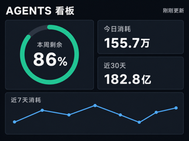
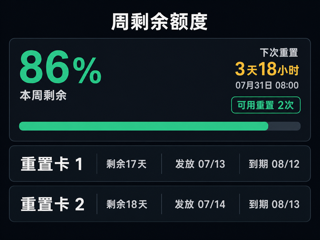
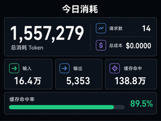
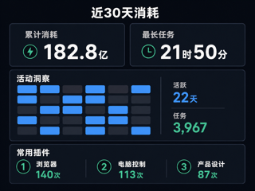

# AP01 AGENTS 看板第 1 版效果图评审

## 1. 文档边界

页面字段与交互要求只见
[`brief.md` 第 3.2 节](../../../brief.md#32-新增-agents-看板一级页面)，技术实现只见
[`AP01 1.0.2_0031 优化固件 DESIGN` 第 7 节](../../../DESIGN/AP01-1.0.2_0031-opt.bin.md#7-agents-看板页面)。
本文只固定第 1 版视觉方向、评审图片和生成提示，不增加或改写功能要求。

| 项目 | 当前状态 |
| --- | --- |
| 评审状态 | 待用户审阅 |
| 数据性质 | 全部为示例数据，不含用户真实数据 |
| 画布 | 四张均为 320×240 |
| 固件状态 | 不是固件内置资源，不授权构建、仅下载或安装 |

## 2. 视觉方向

本项目看板视觉方向只在本节定义：

- 全屏深色界面，不绘制设备外框、触控按钮、关闭按钮或底部导航；
- 背景使用 `#0f1218`，卡片使用 `#1a2028`，边框使用 `#2a3440`；
- 主文字使用近白色，次要文字使用冷灰色；
- 额度和主要状态使用 `#29d3a2`，趋势使用 `#6cb6ff`，倒计时使用 `#f5b942`；
- 优先保证 320×240 下的主数字、标题和分区层级，不放置细小坐标轴或长段说明。

其他文档需要描述看板视觉方向时，只引用本节，不另行定义。

## 3. 第 1 版效果图

### 3.1 概览

### 3.2 周剩余额度详情

### 3.3 今日消耗详情

### 3.4 近 30 天消耗详情

## 4. 生成提示

四张图片共同使用以下提示：

> 为 AP01 的 320×240 横向屏幕生成可交付的紧凑深色界面效果图；全屏显示、中文大字、
> 清晰层级、深色卡片、细边框，不画设备外框、触控控件、导航栏、商标或水印。

各页附加提示：

1. 概览：左侧本周剩余额度圆环，右侧今日消耗与近 30 天消耗卡片，底部近 7 天曲线；
2. 周剩余额度：百分比与进度条、下次重置倒计时和时间、可用重置次数、两张重置卡；
3. 今日消耗：总消耗、请求数、总成本、输入、输出、缓存命中和缓存命中率；
4. 近 30 天消耗：累计消耗、最长任务、30 格活动图、活跃天数、任务数和三个常用插件。

## 5. 文件检查

| 文件 | 像素 | 字节数 | 完整文件指纹 |
| --- | --- | ---: | --- |
| `01-概览-v1.png` | 320×240 | 90,407 | `b25ac6b0cda67198120a5ea43a1b55d119bd96ddf941dd0473cd577be3190eec` |
| `02-周剩余额度-v1.png` | 320×240 | 91,305 | `ff4ed9da7d583f2161adbd30f52ee50f8ab98e2d3a3e4150d71681efde582533` |
| `03-今日消耗-v1.png` | 320×240 | 90,017 | `53a1ed5211d480e8e9bddc67f2409e7d7e71bf2c4226613a80ab4168a037c9ed` |
| `04-近30天消耗-v1.png` | 320×240 | 94,433 | `48fb76a7191179c7a0390c5556fab972e8d8960760ba3f1f8514f7c8d458a0a4` |

用户批准前，不从这些效果图派生无数据底图、页面渲染代码或固件资源。
